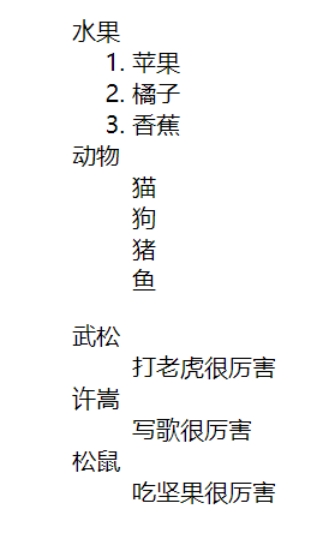
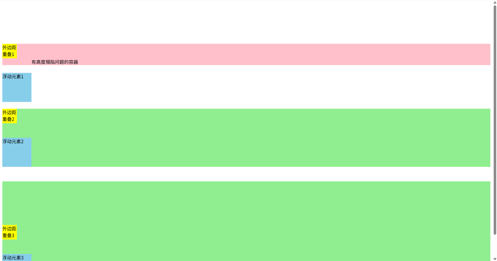
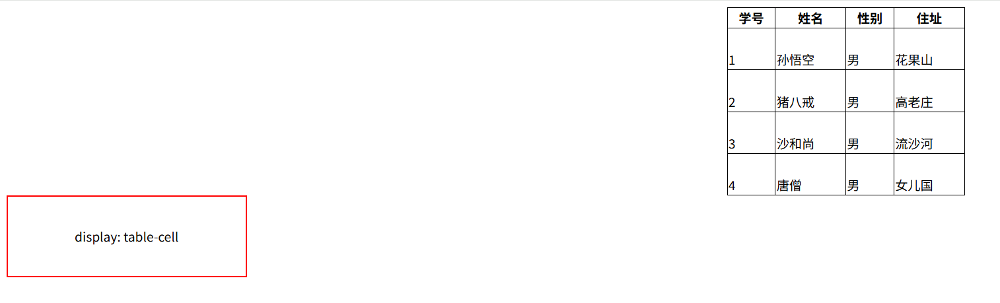

# 软件的架构

## C/S(客户端/服务器)

* 一般我们使用的软件都是C/S架构的
* 比如系统中的软件
  * QQ
  * 微信
  * 等等
* C表示客户端
  * 用户通过客户端来使用软件
* S表示服务器
  * 服务器负责处理软件的业务逻辑
* 特点
  * 使用前必须安装
  * 软件更新时，服务器和客户端得同时更新
  * C/S架构的软件不能跨平台使用
  * C/S架构的软件客户端和服务器通信采用的是自有协议，相对来说比较安全。

## B/S(浏览器/服务器)

* B/S本质上也是C/S，只不过B/S架构的软件，使用浏览器作为软件的客户端
* B/S架构软件通过使用浏览器访问网页的形式，来使用软件
* 特点
  * 不需要安装，直接通过浏览器访问网页
  * 软件更新时，客户端不需要更新
  * 软件可以跨平台，只要系统中有浏览器，就可以使用
  * B/S架构的软件，客户端和服务器通信采用的是通用的HTTP协议，相对来说不安全
  * 可使用HTTPS安全的协议

## W3C标准

* 结构
  * HTML用于描述页面的结构
* 表现
  * CSS用于描述页面的样式
* 行为
  * JavaScript用于描述页面的行为

# HTML简介

* 超文本标记语言
* 它负责网页三要素中的结构
* 使用标签的形式来标识网页中的不同组成部分
* 所谓超文本指的是超链接，使用超链接可以让我们从一个页面跳转到另一个页面

## 标准格式

```html
<!DOCTYPE html>
<html lang="en">
<head>
    <meta charset="UTF-8">
    <title>Document</title>
</head>
<body>

</body>
</html>
```

* `<!DOCTYPE html>`是文档声明

  * HTML4声明方式
    ```html
      <!DOCTYPE HTML PUBLIC "-//W3C//DTD HTML 4.01 Transitional//EN" "http://www.w3.org/TR/html4/loose.dtd">
    ```
  * HTML5声明方式
    ```html
      <!DOCTYPE html>
    ```
  * XHTML声明方式
    ```html
      <?xml version="1.0" encoding="UTF-8"?>
      <!DOCTYPE html
        PUBLIC "-//W3C//DTD XHTML 1.0 Transitional//EN"
        "http://www.w3.org/TR/xhtml1/DTD/xhtml1-transitional.dtd">
    ```
  * 如果不写文档声明，则会导致有些浏览器进入怪异模式，浏览器解析页面无法正常显示
* `<html>`是根标签，有且只有一个，网页中的所有内容写在这个标签里面
* `<head>`标签用来设置网页的头部信息，不会在网页中直接显示，帮助浏览器解析网页
* `<body>`用来设置网页的主体内容，网页中所有可见的内容都写在body标签内
* `<title>`中的内容会显示在网页标题栏，搜索引擎在检索页面时会首先检索title中的内容，它是网页中对于搜索引擎来说最重要的内容，会影响到网页在搜索引擎中的排名
* `<meta charset="UTF-8">`是字符集声明

## html注释

* `<!--注释内容-->`
  * 不会在页面中显示，可在源码中查看
  * 便于自己或其他开发人员的阅读
  * 要养成良好的注释习惯，并且注释要简单明了

## 标签的属性

* 可以通过属性来处理标签的内容
* 可以在开始标签中添加属性
* 属性名 = “属性值”
* 一个标签中可以同时设置多个属性，属性之间需要使用空格隔开

## 进制

* 满几进一
* 二进制
  * 0 1
  * 10 11 100 101 110 111......
* 八进制
  * 0 1 2 3 4 5 6 7
  * 10 11 12 ....16 17 20 21......
* 十进制
  * 0 1 2 3 4 5 6 7 8 9
  * 10 11 12......
* 十六进制
  * 0 1 2 3 4 5 6 7 8 9 A B C D E F
  * 10 11 12...19 1A 1B 1C

## 乱码问题

### 乱码出现的原因

* 计算机在底层只认识0和1
* 在计算机中保存的任何内容，最终都需要转换为二进制编码，包括网页中的内容
* 在读取内容时，需要将二进制编码再转换为正确的内容
* 编码
  * 依据一定的规则，将字符转换为二进制编码的过程
* 解码
  * 依据一定的规则，将二进制编码转换为字符的过程
* 字符集
  * 编码和解码采用的规则，我们称为字符集
  * ASCII
  * ISO-8859-1
  * GBK
    * 中文编码，下面那个也是
  * GB2312
    * 中文系统默认编码
  * UTF-8
    * 万国码，支持世界上所有的文字
  * 等
* 产生乱码的根本原因是，编码和解码采用的字符集不同
* 在中文系统的浏览器中，默认都是使用GB2312进行解码的

### 乱码的解决方法

* 保证编码和解码采用的字符集一致
* 可以在HTML文件中添加字符集声明
  * `<meta charset="UTF-8">`

# 标签

## 常用标签

### 标题标签

* 在HTML中，一共有六级标题标签
* h1~h6
* 在显示效果上h1最大、h6最小，但是文字的大小我们并不关心
* 使用HTML标签时，关心的是标签的语义，我们使用的标签都是语义化标签
* 六级标题中，h1最重要，表示一个网页中的主要内容。h2~h6重要性依次降低
* 对于搜索引擎来说，h1的重要性仅次于title，搜索引擎检索完title，会立即查看h1中的内容
* h1非常重要，他会影响到页面在搜索引擎中的排名，页面一般只写一个h1，否则会被认定为垃圾网站不被搜索
* 一般页面中标题标签只使用h1 h2 h3，其他的基本不使用
  ```html
    <h1>一级标题</h1>
    <h2>二级标题</h2>
    <h3>三级标题</h3>
    <h4>四级标题</h4>
    <h5>五级标题</h5>
    <h6>六级标题</h6>
  ```

  

### 段落标签

* 用于表示内容中的一个自然段
* 使用p标签表示一个段落
* p标签中的文字，默认会独占一行，并且段与段之间会有一个间距
  ```html
    <p>这是一个段落</p>
  ```


### 换行标签

* 在HTML中，字符之间再多的空格，浏览器也会当成一个空格解析
* 换行也会当成一个空格解析
* 为了让浏览器解析时，能够识别换行，需要使用换行标签
* 使用br标签表示一个换行，br是一个自结束标签
  ```html
    悯农
    <br/>
    锄禾日当午，汗滴禾下土。
    <br/>
    谁之盘中餐，粒粒皆辛苦。
  ```

  

### 水平分割线标签

* 使用hr标签表示一个水平分割线
* hr标签是一个自结束标签
  ```html
    巴拉巴拉
    <hr/>
    ps：巴拉巴拉
  ```

  

## 实体

* 在HTML中，一些如><中特色字符是不能直接使用
* 需要使用一些特殊的符号来表示这些特殊字符，这些特殊符号我们称为实体
* 实体语法
  * `&实体名;`
  * `&实体编号;`
* 浏览器解析到实体时，会自动将实体转换为其对应的字符
* 常用实体
  * `&lt;` 小于号 <
  * `&gt;` 大于号 >
  * `&amp;` 与号 &
  * `&nbsp;` 空格
  * `&copy;` 版权符号 ©
  * `&reg;` 注册商标 ®

  ```html
    a<b
    <br/>
    a>c
    <br/>
    ©空     格
  ```

  

## 图片标签

* 使用img标签来向网页中引入一个外部图片
* img标签也是一个自结束标签
* 属性
  * src
    * 设置一个外部图片的路径
  * alt
    * 设置图片的描述
    * 当图片加载失败时，会显示alt中的内容
    * 搜索引擎通过alt来识别不同的图片
    * 搜如果不写alt属性，则搜索引擎不会对img中的图片进行收录
  * width
    * 设置图片的宽度
  * height
    * 设置图片的高度
  * 宽度和高度只设置其中一个，另一个也会等比例调整大小，一般开发中除了自适应的页面，不建议设置width和height属性，而是让美工修改图片。
* 相对路径
  * src属性配置的是图片的路径，目前我们所要使用的路径全都是相对路径
  * 相对于当前资源所在目录的位置
  * ../是返回上级文件夹
* 图片格式
  * JPG
    * 支持颜色比较多，图片可以压缩，但是不支持透明
    * 一般用来保存照片等颜色丰富的图片
  * GIF
    * 支持的颜色少，只支持简单的透明，支持动态图
    * 图片颜色单一或者是动态图用gif
  * PNG
    * 支持的颜色多，并且支持复杂的透明
    * 用来显示颜色复杂的透明的图片
  * SVG
    * 支持的颜色多，并且支持复杂的透明
    * 用来显示颜色复杂的透明的图片
    * 支持缩放
    * 可以通过代码来控制图片的大小
  * WEBP
    * 谷歌新推出的用来表示网页中图片的一种格式
    * 具备其他格式图片的所有优点
    * 文件还特别小
    * 但是兼容性不好
  * base64
    * 字符流图片
    * 通过base64转换为字符
    * 一般都是一些需要和网页一起加载的图片才会使用base64
  * 图片的使用原则
    * 效果不一致，使用效果好的
    * 效果一致，使用小的

  ```html
    <!--引入本地图片-->
    
    <!--引用外部图片-->
    
  ```

## meta标签

* charset
  * 设置网页的字符集

  ```html
    <meta charset="UTF-8">
  ```
* keywords
  * 设置网页的关键字

  ```html
    <meta name="keywords" content="HTML5,JavaScript,前端，Java">
  ```
* description
  * 设置网页的描述

  ```html
    <<meta name="description" content="发布h5、js等前端相关信息">
  ```
* 搜索引擎在检索页面时，会同时检索页面的关键词和描述，但是这两个值不会影响页面在搜索引擎中的排名
* refresh（刷新）
  * 刷新/请求重定向

  ```html
    <!--页面3秒后自动刷新-->
    <meta http-equiv="refresh" content="3;url=index.html"/>
    <!--请求重定向，5秒后打开某网址-->
    <meta http-equiv="refresh" content="5;url=https://www.baidu.com">
  ```

## 布局标签

* header
  * 网页头部

  ```html
    <header></header>
  ```
* main
  * 网页的主体部分
  * 一个页面中只能有一个main

  ```html
    <main></main>
  ```
* footer
  * 网页的底部

  ```html
    <footer></footer>
  ```
* nav
  * 网页的导航栏

  ```html
    <nav></nav>
  ```
* aside
  * 网页的侧边栏

  ```html
    <aside></aside>
  ```
* article
  * 网页的文章

  ```html
    <article></article>
  ```
* section
  * 独立的区块

  ```html
    <section></section>
  ```
* div
  * 没有语义，一个块
  * 目前主要的布局元素
  * 可以代替上边的所有

  ```html
    <div></div>
  ```
* center
  * 居中
  * 已过时，一般用css实现

  ```html
    <center><p>居中显示</p></center>
  ```

# xHtml的语法规范

* HTML中不区分大小写，但是一般都使用小写
* 注释不能嵌套
* 必须结构完整，要么成对出现，要么自结束标签
* 浏览器尽最大的努力正确的解析页面，你所有不符合语法规范的内容，浏览器都会为你自动修正，但是有些情况修正会出现错误
* 可以嵌套，但是不能交叉嵌套
* 属性必须有值，且值必须加引号
* 双引号单引号都可以
* 不按规范也没问题，浏览器可以修正，但最好按规范

# 内联框架

* 引入一个外部的页面
* 属性
  * src

    * 设置一个外部页面的路径,可以是相对路径也可以是绝对路径
  * height

    * 设置框架的高度
  * width

    * 设置框架的宽度
  * name

    * 设置框架的名称
* 在现实开发中不推荐使用内联框架，因为内联框架中的内容不会被搜索引擎所检索
  ```html
    <body>
      <h1>百度</h1>
      <iframe src="https://www.baidu.com" name="tom"></iframe>
    </body>
  ```

  

# 超链接

* 使用超链接可以让我们从一个页面跳转到另一个页面
* 使用a标签来创建一个超链接
* 属性
  * href
    * 指向链接跳转的目标地址，可以写一个相对路径，也可以写一个完整的地址
    * 将该属性值设置为#，点击超链接后回到页面顶部
    * 将该属性值设置为#id，会跳转到该id元素
  * target
    * 打开链接的方式
    * _self
      * 默认值，在当前页面打开链接
    * _blank
      * 在新的页面打开链接
    * _parent
      * 在父级框架中打开链接
    * _top
      * 在整个窗口中打开链接
    * 框架名称
      * 在指定的框架中打开链接

  ```html
    <body>
        <a href="https://cn.vuejs.org/" target="tom">vue</a>
        <iframe src="https://www.baidu.com" name="tom"></iframe>
    </body>
  ```

  

# CSS简介

* 层叠样式表
* CSS可以用来为网页创建样式表，通过样式表对网页进行装饰
* 层叠是将整个网页想象成一层一层的结构，层次高的将会覆盖层低的
* CSS可以为网页的各个层次设置样式

## 内联样式

* 将CSS样式写到元素的style属性当中
* 内联样式只对当前的元素中的内容起作用
* 内联样式不方便样式复用
* 属于结构与表现耦合，不方便后期维护
* 不推荐使用
  ```html
    <p style="color: rebeccapurple;font-size: 30px">锄禾日当午，汗滴禾下土</p>
  ```

## 内部样式

* 将CSS样式写到head标签中的style标签中
* 通过CSS选择器选中指定元素
* 可以同时为这些元素设置样式，使样式进一步复用
* 可以使表现和结构进一步分离
* 推荐的一种使用方式
  ```html
    <!DOCTYPE html>
    <html lang="en">
      <head>
          <meta charset="UTF-8">
          <title>Title</title>
          <style type="text/css">
              p{
                  color: rebeccapurple;
                  font-size: 30px;
              }
          </style>
      </head>
      <body>
          <p>锄禾日当午，汗滴禾下土</p>
          <p>谁之盘中餐，粒粒皆辛苦</p>
      </body>
    </html>
  ```

  

## 外部样式

* 将CSS样式编写到外部CSS文件中
* 步骤

  * 创建一个CSS文件，文件后缀名为.css
  * 编写CSS样式

  ```css
    p{
        color: rebeccapurple;
        font-size: 30px;
    }
  ```

  * 在HTML文件中通过link标签引入CSS文件

  ```html
    <!DOCTYPE html>
    <html lang="en">
      <head>
          <meta charset="UTF-8">
          <title>Title</title>
          <link rel="stylesheet" href="css/style.css"/>
      </head>
      <body>
          <p>锄禾日当午，汗滴禾下土</p>
          <p>谁之盘中餐，粒粒皆辛苦</p>
      </body>
    </html>
  ```
* 可以完全使结构和表现分离，使样式表在不同的页面中使用，最大限度的使样式进行复用
* 将样式统一写在CSS文件中，然后通过link标签引入，可以利用浏览器的缓存，加快用户访问的速度，提高了用户体验。
* 最推荐使用

## CSS的语法

### CSS注释

```css
  /*这是单行注释*/
  /*
    这是一个多行CSS注释
  */
```

### CSS选择器

* 通过选择器可以选中页面中指定的元素
* 将声明块中的样式应用到选择器对应的元素上

### CSS声明块

* 写在选择器后边
* 使用{}括起来
* 实际上就是一组键值对结构，一键值对称为一个声明
* 多个声明之间使用;来隔开
* 声明的样式名和样式值之间使用:来连接

### 块元素和行内元素（内联元素）

* 块元素
  * 独占一行，无论内容有多少
  * div、p、h1、h2...是块元素
  * div标签没有任何语义，就是一个纯粹的块，并且不会为它里边的元素设置任何的默认样式
  * div元素主要用来对页面进行布局的
* 行内元素/内联元素
  * 只占自身大小的元素，不会占用一行
  * a、img、iframe、span是一个内联元素（行内元素）
  * span标签没有任何语义，专门用来选中文字，然后为文字设置样式
* 块元素做页面中的布局，内联元素用来选中文本设置样式
* 一般只使用块元素去包含内联元素，不会用内联元素去包含块元素
* a元素可以包含任意元素，除了它本身
* p元素不能包含任何其他的块元素
* HTML5已经没有内联元素和块元素的概念了

# 选择器

* 详情查看[选择器](选择器.html)

## 常用选择器

### 元素（标签）选择器

* 可以选择页面中的所有指定元素
* 语法
  * 标签名{}
  * 如：选中所有的p元素

  ```css
    p{
        color: red;
    }
  ```

### id选择器

* 通过元素的id属性值选中唯一一个元素
* 语法
  * #id值{}
  * 如：选中id为p1的元素

  ```css
    #p1{
        color: red;
    }
  ```

### 类选择器

* 通过元素的class属性值选中一组元素
* 与id选择器类似，但是可以重复
* 拥有相同class属性值的元素，他们是一组元素
* 可以同时为一个元素设置多个class属性值，多个值之间使用空格隔开
* 语法
  * .class值{}
  * 如：选中class为p2的元素

  ```css
    .p2{
        color: red;
    }
  ```

### 通配选择器

* 选中页面中所有的元素
* 语法
  * *{}
  * 如：选中所有的元素

  ```css
    *{
        color: red;
    }
  ```

### 并集选择器（选择器分组）

* 同时选中多个选择器对应的元素
* 语法
  * 选择器1,选择器2,选择器3...{}
  * 如：选中所有的p元素或者class为p2的元素或者id为p1的元素

  ```css
    p,.p2,#p1{
        color: red;
    }
  ```

### 交集选择器（复合选择器）

* 选中同时满足多个选择器的元素
* 对于id选择器来说，不建议使用复合选择器
* 语法
  * 选择器1选择器2选择器3...{}
  * 如：选中class为p2的div元素

  ```css
    div.p2{
        color: red;
    }
  ```

### 后代元素选择器

* 选中指定元素的所有后代元素
* 语法
  * 选择器1 选择器2{}
  * 如：选中div中的所有p元素

  ```css
    div p{
        color: red;
    }
  ```

### 子元素选择器

* 选中指定元素的所有子元素
* IE6及以下的浏览器不支持子元素选择器
* 语法
  * 父元素 > 子元素{}
  * 如：选中div的子元素中的所有p元素

  ```css
    div > p{
        color: red;
    }
  ```

### 伪类选择器

* 伪类选择器是用来选中元素的某种状态
* 比如：访问过的超链接，普通的超链接，获取焦点的文本框，鼠标悬停的元素等
* 伪类选择器的语法
  * 选择器:伪类名{}

  ```css
    /*选中所有的a元素的鼠标悬停状态*/
    a:hover{
        color: red;
    }
    /*选中所有的a元素的访问过的状态*/
    a:visited{
        color: red;
    }
    /*选中所有的a元素的激活状态*/
    a:active{
        color: red;
    }
    /*选中所有的a元素的未访问状态*/
    a:link{
        color: red;
    }
    /*选中所有的input元素的获取焦点状态*/
    input:focus{
        color: red;
    }
    /*指定元素前面的内容，一般需要结合content样式一起使用，通过content可以向before或after添加一些内容*/
    p::before{
        content: "这是p元素前面的内容";
    }
    /*指定元素后面的内容，一般需要结合content样式一起使用，通过content可以向before或after添加一些内容*/
    p::after{
        content: "这是p元素后面的内容";
    }
    /*选中的元素*/
    p::selection{
        color: red;
    }
    /*选中的元素，火狐浏览器*/
    p::-moz-selection{
        background-color: burlywood;
    }
  ```
* IE6中不支持对超链接以外的元素设置hover和active

### 伪元素选择器

* 伪元素选择器是用来选中元素的某个部分
* 比如：第一个字符，第一个字母，第一个行，第一个段落等
* 伪元素选择器的语法
  * 选择器::伪元素名{}

  ```css
    /*选中所有的p元素的第一个字符*/
    p::first-letter{
        color: red;
    }
    /*选中所有的p元素的第一个行*/
    p::first-line{
        color: red;
    }
    /*选中所有的p元素的第一个段落*/
    p::first-letter{
        color: red;
    }
  ```

### 属性选择器

* 根据元素中的属性或属性值来选择指定元素
* 语法
  * [属性名] 选取含有指定属性名的元素
  * [属性名=属性值] 选取含有指定属性名和属性值的元素
  * [属性名^=属性值] 选取属性值以指定值开头的元素
  * [属性名$=属性值] 选取属性值以指定值结尾的元素
  * [属性名*=属性值] 选取属性值中包含指定值的元素

  ```css
    /*选中所有具有href属性的a元素*/
    a[href]{
        color: red;
    }
    /* 选中所有的class属性值为p2的元素*/
    [class=p2]{
        color: red;
    }
    /* 选中所有的class属性值以pa开头的元素*/
    [class^=pa]{
        color: red;
    }
    /* 选中所有的class属性值以pa结尾的元素*/
    [class$=pa]{
        color: red;
    }
    /* 选中所有的class属性值中包含pa的元素*/
    [class*=pa]{
        color: red;
    }
  ```

### 子元素伪类

* 子元素伪类是用来选中元素的子元素的
* 语法
  ```css
    /*选中所有的p元素的第一个子元素,当第一个子元素不是p元素时则无效*/
    div:first-child{
        color: red;
    }
    /*选中所有的p元素的最后一个子元素,当最后一个子元素不是p元素时则无效*/
    div:last-child{
        color: red;
    }
    /*选中所有的p元素的第n个子元素,当第n个子元素不是p元素时则无效*/
    div:nth-child(n){
        color: red;
    }
    /* 选中所有的p元素的偶数位子元素 */
    div:nth-child(even){
        color: red;
    }
    /* 选中所有的p元素的奇数位子元素 */
    div:nth-child(odd){
        color: red;
    }
    /* 选择同类型标签第一个子元素 */
    div:first-of-type{
        color: red;
    }
    /* 选择同类型标签最后一个子元素 */
    div:last-of-type{
        color: red;
    }
    /* 选择同类型标签第n个子元素 */
    div:nth-of-type(n){
        color: red;
    }
  ```
* child和of-type的区别
  * child是选中所有的子元素，of-type是选中同类型的子元素
  * child是从1开始计数，of-type是从0开始计数

### 兄弟元素选择器

* 兄弟元素选择器是用来选中元素的兄弟元素的
* 语法
  ```css
    /* 选中span后的一个p元素 */
    span + p{
        color: red;
    }
    /* 选中span后的所有p元素 */
    span ~ p{
        color: red;
    }
  ```

### 否定伪类

* 否定伪类是用来选中不满足条件的元素的
* 语法
  ```css
    /* 选中所有的p元素，但是不包括class为p2的元素 */
    p:not(.p2){
        color: red;
    }
  ```

### 样式的继承

* 后代元素会继承祖先元素上的样式
* 利用继承，可以将一些基本的样式设置给祖先元素，所有的后代元素都会继承这些样式
* 并不是所有的样式都会被后代元素所继承，如：背景、边框、定位相关的样式不会被继承

### 样式的优先级

* 当一个元素上有多个样式时，会根据样式的优先级来决定最终的样式
* 样式的优先级分为以下几种
  * 行内样式 > 内部样式 > 外部样式
  * 当行内样式和内部样式同时存在时，会根据样式的优先级来决定最终的样式

### 选择器的优先级

* 当使用不同的选择器选中同一个元素，并且设置相同的样式，这时样式之间产生了冲突，优先级高的优先显示
* 优先级规则
  * 内联样式：1000
  * id选择器：100
  * 类和伪类选择器：10
  * 标签选择器： 1
  * 通配选择器： 0
* 继承的样式，没有优先级
* 当选择器中包含多种选择器时，需要将多种选择器的优先级相加进行比较，但是，选择器优先级计算不会超过他的最大数量级
* 如果选择器的优先级一样，后声明的样式会覆盖先声明的样式
* 并集选择器的优先级是单独计算的，不会相加
* 可以在样式的最后，添加一个!important，则此时该样式将会获得最高的优先级，但是在开发中尽量避免使用

### 伪类的顺序

* 这四个选择器的优先级是一样的，但是请按以上的顺序写，不然会被覆盖
  * :link
  * :visited
  * :hover
  * :active

# 文本标签

* `<em>`
  * 斜体
  * 用于表示强调的内容
  * 有语义
* `<strong>`
  * 加粗
  * 用于表示重要的内容
  * 有语义
* `<i>`
  * 斜体
  * 用于表示斜体的内容
  * 无语义
* `<b>`
  * 加粗
  * 用于表示加粗的内容
  * 无语义
* `<small>`
  * 比父元素字号小一些
  * 表示一类细则内容
  * 如：合同中小字、网站版权声明等
* `<cite>`
  * 表示参考内容
  * 如：书名、歌曲名、电影名等
* `<q>`
  * 引号
  * 短引用（行内引用）
  * 引号不能被选中
* `<blockquote>`
  * 长引用（块级引用）
* `<sup>`
  * 上标
  * 如：2的9次方
* `<sub>`
  * 下标
* `<ins>`
  * 下划线
  * 表示插入的内容
* `<del>`
  * 删除线
  * 表示删除的内容
* `<pre>`
  * 预格式标签
  * 保留代码原格式
* `<code>`
  * 代码标签
  * 表示一段代码
    [文本标签](文本标签.html)
    

# 列表

## 无序列表

* 无序列表使用ul标签来定义
* 每个列表项使用li标签来定义
* 列表项前面会显示一个小的蓝色的圆点
* 无序列表的语法
  ```html
    <ul>
        <li>列表项1</li>
        <li>列表项2</li>
        <li>列表项3</li>
    </ul>
  ```
* 小圆圈的类型可以通过list-style-type属性来修改
  * disc
    * 默认值，蓝色实心圆点
  * circle
    * 黑色空心的圆点
  * square
    * 实心方块
  * none
    * 不显示列表项前面的小圆圈

  ```css
    ul{
        list-style-type: disc;
    }
  ```
* 小圆圈的位置可以通过list-style-position属性来修改
  * outside
    * 默认值，列表项前面的小圆圈会显示在列表项的外面
  * inside
    * 列表项前面的小圆圈会显示在列表项的里面

  ```css
    ul{
        list-style-position: outside;
    }
  ```
* 可以通过list-style-image属性将小圆圈替换为一个图片
  * url(图片路径)
    * 显示一个小的图片

  ```css
    ul{
        list-style-image: url(images/1.png);
    }
  ```

## 有序列表

* 有序列表使用ol标签来定义
* 每个列表项使用li标签来定义
* 列表项前面会显示一个数字
* 有序列表的语法
  ```html
    <ol><!--有序列表,默认1234-->
        <li>苹果</li><!--列表项-->
        <li>橘子</li>
        <li>香蕉</li>
    </ol>
  ```
* 数字的类型可以通过list-style-type属性来修改
  * decimal
    * 默认值，数字
  * decimal-leading-zero
    * 数字前面会显示0
  * lower-alpha
    * 小写字母
  * upper-alpha
    * 大写字母
  * lower-roman
    * 小写罗马数字
  * upper-roman
    * 大写罗马数字
  * none
    * 不显示列表项前面的数字

    ```css
      ol{
          list-style-type: decimal;
      }
    ```

    

## 自定义列表

* 自定义列表使用dl标签来定义
* 每个列表项使用dt标签来定义
* 每个列表项的描述使用dd标签来定义
* 自定义列表的语法
  ```html
    <dl>
        <dt>武松</dt>
        <dd>打老虎很厉害</dd>
        <dt>许嵩</dt>
        <dd>写歌很厉害</dd>
        <dt>松鼠</dt>
        <dd>吃坚果很厉害</dd>
    </dl>
  ```

  

## 列表的嵌套

* ul，ol，dl列表之间可以互相嵌套
  ```html
   <ul><!--无序列表，默认圆点-->
       <li>水果</li><!--列表项-->
       <ol><!--嵌套列表-->
           <li>苹果</li><!--列表项-->
           <li>橘子</li>
           <li>香蕉</li>
       </ol>
       <li>动物</li>
       <ul><!--嵌套列表-->
           <li>猫</li><!--列表项-->
           <li>狗</li>
           <li>猪</li>
           <li>鱼</li>
       </ul>
       <dl>
           <dt>武松</dt>
           <dd>打老虎很厉害</dd>
           <dt>许嵩</dt>
           <dd>写歌很厉害</dd>
           <dt>松鼠</dt>
           <dd>吃坚果很厉害</dd>
       </dl>
   </ul>
  ```

  

# 长度单位

* px
  * 像素
  * 最常用的单位
  * 不同的显示器一个像素的大小也不同，显示效果越好越清晰，像素点越小，反之像素点越大
* %
  * 百分比
  * 相对于父元素的宽度或高度的百分比
  * 当父元素值发生变化时子元素也会等比例变化
  * 创建自适应页面时经常使用百分比作为单位
* em
  * 相对于自身元素的字体大小来计算
  * 1em = 1font-size
  * 当字体大小发生改变，em也会随之改变
  * 设置字体相关的样式时使用
* rem
  * 相对于根元素的字体大小来计算
    [长度单位](长度单位.html)
    

# 颜色单位

## 单词

* red 红色
* blue 蓝色
* green 绿色
* 等

## RGB

* RGB指的是Red Green Blue三原色
  * 通过这三种颜色的不同浓度，来表示不同的颜色
  * 语法：
    * rgb(红色浓度,绿色浓度,蓝色浓度)
    * 浓度范围：0-255
    * 浓度也可以采用百分数表示

## RGBA

* 在RGB的基础上增加一个a表示不透明度
* 需要四个值，前三个和rgb一样，第四个表示不透明度
* 不透明度的范围：0-1

## 十六进制

* 与RGB原理一样
* 使用三组两位的十六进制数组表示一个颜色
* 每组取00~ff
* 语法
  * #rrggbb
* 两位重复的颜色可以简写，如#ff0000可写成#f00

## HSL和HSLA

* HSL指的是Hue(色相)，Saturation(饱和度)，Lightness(亮度)
* 色相：0-360
* 饱和度：0-100%
* 亮度：0-100%
* 语法
  * hsl(色相,饱和度,亮度)
  * hsla(色相,饱和度,亮度,不透明度)

# 字体

## 属性

* color
  * 字体颜色
  * 可以使用单词，rgb，rgba，十六进制，hsl，hsla等

  ```css
    color: red;
  ```
* font-size
  * 字体大小
  * 浏览器一般默认的文字大小都是16px
  * 设置的并不是文字本身的大小
  * 在页面中，每个文字都是放在一个看不见的格子中
  * 设置的font-size实际上是设置格的高度
  * 一般情况文字实际大小要比格子小
  * 根据字体的不同，显示效果也不同
  * 浏览器最小字体大写是12px

  ```css
    font-size: 16px;
  ```
* font-family
  * 字体
  * 当浏览器支持则使用该字体
  * 如果浏览器不支持则使用默认字体
  * 同时指定多个字体，多个字体之间使用,分开，当采用多个字体时，浏览器会优先使用前边的字体，如果前边不支持，再逐一使用后边的字体
  * 浏览器使用的字体就是用户计算机的字体
  * 在开发中尽量不要用不常用的字体

  ```css
    font-family: "宋体", "微软雅黑", "黑体";
  ```
* font-style
  * 字体样式
  * normal 正常
  * italic 斜体
  * oblique 倾斜
  * inherit 继承父元素的字体样式

  ```css
    font-style: normal;
  ```
* font-weight
  * 字体粗细
  * normal 正常
  * bold 加粗
  * bolder 更粗
  * lighter 更细
  * inherit 继承父元素的字体粗细
  * 100-900
    * 数字越大越粗
    * 400是正常
    * 由于用户计算机没有这么多级别的字体，所以不能达到我们想要的效果，一般不使用

  ```css
    font-weight: normal;
  ```
* font-variant
  * 字体变形
  * normal 正常
  * small-caps 小型大写字母
  * inherit 继承父元素的字体变形

  ```css
    font-variant: normal;
  ```
* font
  * 同时设置字体所有类型的样式
  * 不同的值用空格隔开
  * 必要属性
    * font-size
    * font-family
    * 必须先写font-size，再写font-family
  * 可选属性
    * font-style
    * font-weight
    * font-variant
  * 设置的属性会继承父元素值（如未指定 font-weight 则沿用父级设置）

  ```css
    font: 16px "宋体", "微软雅黑", "黑体";
  ```

## 字体分类

* serif 衬线字体
* sans-serif 非衬线字体
* monospace 等宽字体
* cursive 草书字体
* fantasy 虚幻字体
* system-ui 系统字体
* emoji 表情符号字体
* math 数学字体
* 可以将字体设置为大的分类，浏览器会自动选择指定的字体样式并应用样式
* 一般会将字体的大分类，指定为font-family中的最后一个字体

```html
  <p class="p1">我是p标签</p>
  <p style="font-family: Serif;">衬线字体abcdEFG</p>
  <p style="font-family: sans-serif;">非衬线字体abcdEFG</p>
  <p style="font-family: monospace;">等宽字体abcdEFG</p>
  <p style="font-family: cursive;">草书字体abcdEFG</p>
  <p style="font-family: fantasy;">虚幻字体abcdEFG</p>
```

## 行高

* 在CSS中并没有直接设置行间距的方式
* 通过设置行高间接的设置行间距，行高越大，行间距越大
* 使用line-height设置行高

```css
  line-height: 40px;
```

* 网页中的文字会默认在行高中垂直居中
* 行间距 = 行高 - 字体大小
* 可以传一个百分数，则会相对于字体去计算行高

```css
  line-height: 150%;
```

* 可以传一个整数，则行高会设置字体大小相应的倍数

```css
  line-height: 1.5;
```

* 对于单行文本来说，将行高设置为和父元素的高度一致，可以使文本垂直居中
* 在font中也可以指定行高

```css
  font: 16px/40px "宋体", "微软雅黑", "黑体";
```

[行高](行高.html)


## 文本样式

* text-transform
  * 文本转换
  * none 不转换
  * capitalize 首字母大写
  * uppercase 全部大写
  * lowercase 全部小写
  * inherit 继承父元素的文本转换

  ```css
    text-transform: none;
  ```
* text-decoration
  * 文本装饰
  * none 不装饰
  * underline 下划线
  * overline 上划线
  * line-through 删除线
  * blink 闪烁
  * inherit 继承父元素的文本装饰
  ```css
    text-decoration: none;
  ```
* text-align
  * 文本对齐
  * left 左对齐
  * right 右对齐
  * center 居中对齐
  * justify 两端对齐
  * inherit 继承父元素的文本对齐
  ```css
    text-align: left;
  ```
  * a标签超链接默认添加下划线，如果要去除，则将text-decoration设置为none
* letter-spacing
  * 字母间距
  * 可以传一个值，值为正数，则会增加字母间距，值为负数，则会减少字母间距
  * 可以传一个百分数，则会相对于字体去计算字母间距

  ```css
    letter-spacing: 10px;
  ```
* word-spacing
  * 单词间距
  * 可以传一个值，值为正数，则会增加单词间距，值为负数，则会减少单词间距
  * 可以传一个百分数，则会相对于字体去计算单词间距

  ```css
    word-spacing: 10px;
  ```
* text-indent

  * 文本缩进
  ```css
    /* 缩进20px */
    text-indent: 20px;
    /* 缩进两个字体 */
    text-indent: 2em;
  ```
* text-align
  * 文本对齐
  * left 左对齐
  * right 右对齐
  * center 居中对齐
  * justify 两端对齐
  * inherit 继承父元素的文本对齐
  ```css
    text-align: left;
  ```

* vertical-align
  * 垂直对齐
  * baseline 默认值，基线对齐
  * top 顶部对齐
  * middle 居中对齐，不是严格意义的居中
  * bottom 底部对齐
  * 指定值 可以指定一个具体的数值，单位为px，正值往上，负值往下
  * 可用此方法取消图片的基线对齐
    * vertical-align: bottom;

* white-space
  * normal 正常，默认值，会自动换行
  * nowrap 不换行
  * pre 保留空格
  * pre-wrap 保留空格，自动换行
  * pre-line 保留空格，自动换行，但是会合并多个空格

* 裁剪多余的内容
  * overflow: hidden;

* 在溢出内容的后方显示省略号
  * text-overflow: ellipsis;

[文本样式](文本样式.html)


## @font-face选择器

* 可以将服务器中的字体直接提供给用户去使用
* font-family
  * 指定字体的名字
* src 
  * 服务器中字体的路径和字体格式
  * format写不写都行
* 问题
  * 加载速度慢
  * 版权问题
  * 字体格式兼容
* 免费字体下载
  * [免费字体下载](https://www.fonts.net.cn/)
```css
@font-face {
  font-family: "myFont";
  src: url("fonts/kaiti.ttf") format("truetype");
}
```
[@font-face选择器](@font-face选择器.html)


## 图标字体

* 在网页中经常需要使用一些图标
* 可以通过图片来引入图标，但是图片大小本身比较大，并且非常的不灵活
* 所以在使用图标时，我们还可以将图标直接设置为字体，然后通过font-face的形式来对字体进行引入
* 使用时注意版权问题

### fontawesome

#### 使用方式

* 下载 https://fontawesome.com/
* 解压
* 将css和webfonts移动到项目中
* 将all.css引入到网页中
* 使用图标字体
  * 直接通过类名来使用图标字体
  * class="fas fa-bell"
  * class="fab fa-accessible-icon"
```html
  <!DOCTYPE html>
  <html lang="en">
  <head>
    <meta charset="UTF-8">
    <meta name="viewport" content="width=device-width, initial-scale=1.0">
    <meta http-equiv="X-UA-Compatible" content="ie=edge">
    <title>Document</title>
    <link rel="stylesheet" href="./fa/css/all.css">
  </head>
  <body>
    <i class="fas fa-bell" style="font-size:80px; color:red;"></i>
    <i class="fas fa-bell-slash"></i>
    <i class="fab fa-accessible-icon"></i>
    <i class="fas fa-otter" style="font-size: 160px; color:green;"></i>
  </body>
  </html>
```

#### 其他使用方式

* 通过伪元素来设置图标字体
  * 找到要设置图标的元素通过before或after选中
  * 在content中设置字体的编码
  * 设置字体的样式
    * fab
      * font-family: 'Font Awesome 5 Brands';
    * fas
      * font-family: 'Font Awesome 5 Free';
      * font-weight: 900;
* 通过实体方式使用
  * &#x图标的编码;
  * <span class="fas">&#xf0f3;</span>
```html
  <!DOCTYPE html>
  <html lang="en">
  <head>
      <meta charset="UTF-8">
      <meta name="viewport" content="width=device-width, initial-scale=1.0">
      <meta http-equiv="X-UA-Compatible" content="ie=edge">
      <title>Document</title>
      <link rel="stylesheet" href="./fa/css/all.css">
      <style>
          li{
              list-style: none;
          }
          li::before{
              /*
                  通过伪元素来设置图标字体
                      1.找到要设置图标的元素通过before或after选中
                      2.在content中设置字体的编码
                      3.设置字体的样式
                          fab
                          font-family: 'Font Awesome 5 Brands';

                          fas
                          font-family: 'Font Awesome 5 Free';
                          font-weight: 900;

              */
              content: '\f1b0';
              /* font-family: 'Font Awesome 5 Brands'; */
              font-family: 'Font Awesome 5 Free';
              font-weight: 900;
              color: blue;
              margin-right: 10px;
          }
      </style>
  </head>
  <body>
  <!-- <i class="fas fa-cat"></i> -->
  <ul>
      <li>锄禾日当午</li>
      <li>汗滴禾下土</li>
      <li>谁知盘中餐</li>
      <li>粒粒皆辛苦</li>
  </ul>
  <!--

      通过实体来使用图标字体：
          &#x图标的编码;
  -->
  <span class="fas">&#xf0f3;</span>
  </body>
  </html>
```

### 阿里字体库

* [阿里字体库](https://www.iconfont.cn/)
* 使用方式
  1. 
  2. 
  3. 
  4. 
  5. 
  6. 
  7. 将CSS文件引入到页面：<link rel="stylesheet" href="./iconfont/iconfont.css">
  8. 在需要使用图标的元素中添加类名：<i class="iconfont icon-xxx"></i>
[使用阿里字体库](使用阿里字体库.html)


# 盒模型

* CSS处理网页时，认为每个元素都包含在一个不可见的盒子里
* 只需要将相应的盒子摆放到网页中相应的位置即可完成网页的布局
* 一个盒子可分成4个部分
  * 内容区（content）
  * 内边距（padding）
  * 边框（border）
  * 外边距（margin）

## 边框

* 要为元素设置边框必须指定三个样式
  * border-width
    * 边框的宽度
    * 如果设置四个值,则会分别设置上右下左的边框宽度
    * 如果只设置三个值，则会分别设置给上 左右 下
    * 如果只设置两个值，则会分别设置给上下 左右
    * 如果只设置一个值，则设置给四边
  ```css
    border-width: 1px;
    border-width: 1px 2px;
    border-width: 1px 2px 3px;
    border-width: 1px 2px 3px 4px;
  ```
  * border-color
    * 边框的颜色
    * 如果设置四个值,则会分别设置上右下左的边框颜色
    * 如果只设置三个值，则会分别设置给上 左右 下
    * 如果只设置两个值，则会分别设置给上下 左右
    * 如果只设置一个值，则设置给四边
  ```css
    border-color: red;
    border-color: red blue;
    border-color: red blue green;
    border-color: red blue green yellow;
  ```
  * border-style
    * 边框的样式
    * 如果设置四个值,则会分别设置上右下左的边框样式
    * 如果只设置三个值，则会分别设置给上 左右 下
    * 如果只设置两个值，则会分别设置给上下 左右
    * 如果只设置一个值，则设置给四边
    * 枚举值
      * none 无边框
      * hidden 隐藏边框
      * solid 实线
      * dotted 点状边框
      * dashed 虚线
      * double 双线边框
  ```css
    border-style: solid;
    border-style: solid dotted dashed double;
  ```
* 大部分的浏览器中，边框的宽度和颜色都是有默认值的，而边框的样式默认值都为none
* width和height属性只是设置盒子的内容区大小，而不是盒子的整个大小
* border-xxx-width
  * 设置指定位置边框的宽度
  * 枚举值
    * top
    * right
    * bottom
    * left
```css
 border-top-width: 5px;
```

* border-xxx-color
  * 设置指定位置边框的颜色
  * 枚举值
    * top
    * right
    * bottom
    * left
```css
 border-left-color: red;
```

* border-xxx-style
  * 设置指定位置边框的样式
  * 枚举值
    * top
    * right
    * bottom
    * left
```css
 border-right-style: dashed;
```

### 边框简写
* border
  * 设置边框的样式、宽度、颜色
  * 无任何顺序要求
  * 不能分别指定每个边
```css
  border: 5px solid red;
```
* border-xxx
  *  设置指定位置的边框样式、宽度、颜色
  * 枚举值
    * top
    * right
    * bottom
    * left
```css
  border-right: 5px solid red;
```
## 内边距
* 内容区与盒子边框之间的距离
* padding-xxx
  * 设置指定位置的内边距
  * 枚举值
    * top
    * right
    * bottom
    * left
```css
  padding-top: 10px;
```
* padding
  * 设置所有边的内边距
  * 如果设置四个值,则会分别设置上右下左的边框样式
  * 如果只设置三个值，则会分别设置给上 左右 下
  * 如果只设置两个值，则会分别设置给上下 左右
  * 如果只设置一个值，则设置给四边
```css
  padding: 10px;
  padding: 10px 20px;
  padding: 10px 20px 30px;
  padding: 10px 20px 30px 40px;
```
* 内边距会影响盒子的可见框的大小
* 元素的背景会影响内容区和内边距
* 盒子的大小(可见大小) = 内容区 + 内边距 + 边框

## 外边距
* 盒子与盒子之间的距离
* 不会影响盒子可见框的大小，而是会影响盒子的位置
* margin-xxx
  * 设置指定位置的外边距
  * 枚举值
    * top
    * right
    * bottom
    * left
```css
  margin-top: 10px;
```
* 由于页面中的元素都是左上角摆放的，所以设置上和左外边距时，会导致盒子的位置发生改变。
* 而设置右和下外边距时，会改变其他盒子的位置
* 外边距也可以定为负值，往反方向移动
* margin
  * 设置所有边的外边距
  * 如果设置四个值,则会分别设置上右下左的边框样式
  * 如果只设置三个值，则会分别设置给上 左右 下
  * 如果只设置两个值，则会分别设置给上下 左右
  * 如果只设置一个值，则设置给四边
```css
  margin: 10px;
  margin: 10px 20px;
  margin: 10px 20px 30px;
  margin: 10px 20px 30px 40px;
```
* 可以设置为auto
  * 一般只设置水平方向的auto
  * 只指定左外边距和右外边距其中一个的margin为auto则会将外边距设置为最大值
  * 垂直方向设置为auto，则外边距默认就是0
  * 同时将左外边距和右外边距同时设置为auto时，则会将两侧外边距设置为相同的值，即在父元素中水平居中，常用
```css
  margin: 0 auto;
```
* 扩展
  * width和height也可以设置为auto
  * 此时会根据内容区的大小来设置宽度和高度
  * 当元素的宽度或高度的值是auto时，此时指定内边距不会影响可见框的大小，而是会自动修改宽度，以适应内边距
```css
  width: auto;
  height: auto;
```

## 垂直外边距的重叠
* 当两个垂直方向的外边距相遇时，会发生外边距重叠
* 兄弟元素垂直方向的外边距相遇时，取两个外边距中的最大值
* 父子元素垂直方向的外边距相遇时，会把外边距设置给父元素，且取两个外边距中的最大值
* 只想移动子元素的解决方法
  * 新增元素让当前子元素与父元素隔开
  * 为父元素设置边框
  * 为父元素设置内边距
[外边距重叠](外边距重叠.html)

# 浏览器默认样式
* 浏览器会为页面设置默认样式，让页面在没有样式时更好的显示
* 所以会为很多元素设置一些默认的margin和padding
* 正常情况下不需要使用默认值，可以将默认值重置为0
* 可以使用通配符重置所有元素的默认值
```css
  * {
    margin: 0;
    padding: 0;
  }
```

# 内联元素的盒模型
* 内联元素不能设置内容区的宽度（width）和高度(height)
* 内联元素可以设置水平方向的内边距
* 内联元素可以设置垂直方向的内边距，但是不会影响页面布局，可能会把其他元素覆盖
* 内联元素可以设置边框，但是垂直方向的边框不会影响页面布局，可能会把其他元素覆盖
* 内联元素可以设置水平方向的外边距、不能设置垂直方向的外边距
[内联元素的盒模型](内联元素的盒模型.html)


# display和visibility

## display
* 修改元素类型
* 可以将块元素改成内联元素，也可以将内联元素改成块元素
* 枚举值
  * block 块元素
  * inline 内联元素
  * inline-block 内联块元素（行内块元素）
    * 可以使一个元素既有内联元素的特点，又有块元素的特点
    * 既可以设置宽高，又不会独占一行
  * table 表格元素
  * none 隐藏元素
  * flex 弹性盒子

## visibility
* 修改元素的可见性
* 枚举值
  * visible 可见
  * hidden 隐藏

## display:none与visibility:hidden的区别
* display:none会隐藏元素，并且会让元素不再占用空间
* visibility:hidden会隐藏元素，但是会让元素继续占用空间

# overflow（溢出）
* 子元素默认在父元素的内容区中
* 但如果子元素的大小超过父元素的内容区，则超过的大小会在父元素以外显示
* 超出父元素的内容称为溢出内容
* 通过overflow为父元素设置如何处理溢出内容
* 枚举值
  * visible 不做任何处理（可见）
    * 溢出内容会在父元素外显示，默认值
  * hidden 隐藏溢出内容
    * 溢出内容不会在父元素外显示
  * scroll 显示滚动条
    * 溢出内容会被修剪，但是有滚动条可查看其余内容
    * 该属性无论内容是否溢出，都会显示双向滚动条
  * auto 自动显示滚动条
    * 自动添加滚动条，比scroll更加智能

# 文档流
* 文档流处在网页的最底层，它表示的是一个页面中的位置
* 我们所创建的元素默认都处在文档中

## 元素在文档流中的特点

### 块元素
* 在文档流中独占一行，会默认自上向下排列
* 在文档流中默认宽度是父元素的100%
* 在文档流中默认高度默认被内容区撑开

### 内联元素
* 在文档流中只占自身的大小，会默认从左向右排列
* 会自动换行
* 在文档流中的宽度和高度默认都被内容撑开

## 浮动
* 把浮动想象成气球
* 如果希望块元素在页面中水平排列，可以使块元素脱离文档流
* 使用float使元素浮动，从而脱离文档流
* 当为一个元素设置浮动以后，元素会立即脱离文档流，还在文档流中的元素会重新按文档流摆放位置
* 元素浮动以后会尽量向左上或者右上漂浮，直到遇到父元素的内容区边界或没有浮动的块元素或其它浮动元素为止
* 如果浮动元素上边是一个没有浮动的块元素，则浮动元素不会超过块元素
* 浮动的元素不会超过它的相邻兄弟元素，最多顶部对齐
* 浮动的元素不会盖住文字，文字会环绕在浮动元素的周围，可以通过浮动来设置文字环绕图片浮动的效果
* 块元素设置浮动后，元素将不再有文档流的默认宽度，高度和宽度都会被内容撑开，内联元素设置浮动以后会变成块元素，可以直接设置宽高
### float
* 枚举值
  * none 不浮动
  * left 向左浮动
  * right 向右浮动
  * inherit 继承父元素的浮动
[浮动](浮动.html)


# 高度塌陷问题
* 在文档流中，父元素的高度默认是被子元素撑开的，也就是子元素多高，父元素就是多高
* 但是当为子元素设置浮动以后，子元素会完全脱离文档流
* 此时将会导致子元素无法撑起父元素的高度，从而导致父元素的高度塌陷
* 由于父元素的高度塌陷，则父元素下方的所有元素都会向上移动，这样将会导致页面布局混乱
* 开发中一定要避免高度塌陷的问题
* 可以将父元素的高度写死，以避免塌陷问题出现，但是父元素的高度将不能自动适应子元素的高度，这种方案不推荐使用
## 解决高度塌陷问题的方法
* 根据W3C的标准，在页面中元素都有一个隐含的属性叫做Block Formatting（格式化） Context，简称BFC
* 该属性可以设置打开或者关闭，默认是关闭的
* 当开启元素的BFC后，元素将会具有如下特性
  * 父元素的垂直外边距不会和子元素重叠
  * 开启BFC的元素不会被浮动元素覆盖
  * 开启BFC的父元素可以包含浮动的子元素
* 如何开启元素的BFC
  * 设置元素浮动
    * 使用这种方式开启，可以撑开父元素，但是会导致父元素的默认宽度丢失
    * 而且使用这种方式也会导致下边的元素上移，不能解决问题
  * 设置元素绝对定位
  * 设置元素为inline-block
    * 可以解决问题，但是会导致父元素的默认宽度丢失，不推荐使用
  * 将元素的overflow设置为一个非visible的值
    * 副作用最小的开启BFC方式，推荐使用
  ```css
    .box {
      overflow: hidden;
    }
  ```
  * 但是ie6及以下浏览器并不支持BFC
  * 在ie6及以下浏览器中虽然没有BFC，但是具有另一个隐含的属性hasLayout，该属性的作用和BFC类似，可以通过开启hasLayout来解决问题
  * 开启hasLayout的方式
    * 直接将元素的zoom设置为1
    * 如果元素指定了一个宽度，则会默认开启hasLayout
  ```css
    .box {
      zoom: 1;
    }
  ```
## 解决高度塌陷的最终方案
### 兄弟元素之间的高度塌陷
* 希望清除掉其他元素浮动对当前元素产生的影响，可以使用伪元素+clear来完成功能
* clear
  * 清除浮动
  * 枚举值
    * none 不清除浮动
    * left 清除左侧浮动元素对当前元素的影响
    * right 清除右侧浮动元素对当前元素的影响
    * both 清除左右两侧的浮动元素对当前元素的影响
    * 清除浮动以后，元素会回到浮原来的位置
* 使用clear解决兄弟元素之间的高度塌陷的问题
```css
 .box {
    clear: both;
  }
```
### 父子元素之间的高度塌陷
* 解决方式1
  * 直接在高度塌陷的父元素的最后，添加一个空白的div
  * 然后清除该div的浮动
  * 使用这种方式虽然可以解决问题，但是会在页面中添加多余的结构
* 解决方式2
  * 伪元素+clear解决高度塌陷的问题
  * 通过after伪类，在父元素的最后添加一个空白的div
  * 然后清除该div的浮动
  * 这种方式不会在页面中添加多余的结构
  * 这种方式是最推荐使用的方式
  * IE6中不支持after伪类，还需要使用hasLayout来处理
```css
  .box::after {
    content: "";
    display: block;
    clear: both;
  }
```
* 解决方式3
  * 既可以解决高度塌陷，又可以确保父元素和子元素的垂直外边距不会重叠
  * 详情跳转[完善clearfix](#完善clearfix)
[高度塌陷](高度塌陷.html)


# 定位

* 将指定元素摆放到页面的任意位置
* 通过position属性来设置元素的定位
* position
  * static 静态定位
  * relative 相对定位
  * absolute 绝对定位
  * fixed 固定定位
  * sticky 粘性定位

## 相对定位

* 当开启了元素的相对定位，而不设置偏移量，元素不会发生任何变化
* 相对定位是相对于元素在文档流中原来的位置进行定位
* 偏移量
  * top 顶部
  * bottom 底部
  * left 左侧
  * right 右侧
* 相对定位的元素不会脱离文档流
* 会使元素提升一个层级，可能覆盖原本层级的元素，但它在文档流中仍然保留原始占位空间
* 通常偏移量只需要设置left和top
* 相对定位不会改变元素的性质，块还是块，内联还是内联
```css
  .box {
    position: relative;
    left: 200px;
    top: 200px;
  }
```
[相对定位](相对定位.html)


## 绝对定位

* 开启绝对定位会使元素脱离文档流
* 开启绝对定位以后，如果不设置偏移量，则元素的位置不会发生变化
* 偏移量
  * top 顶部
  * bottom 底部
  * left 左侧
  * right 右侧
* 离他最近并开启了定位的祖先元素进行定位
* 如果所有的祖先元素都没有开启定位，则相对于浏览器窗口进行定位
* 一般开启了子元素的绝对定位，都会开启父元素的相对定位(子绝父相)
* 会使元素提升一个层级，可能覆盖原本层级的元素，不会保留原始的占位空间
* 绝对定位不会改变元素的性质，块元素的宽度和高度会被内容撑开，内联变为块元素
```css
  .box {
    position: absolute;
    left: 200px;
    top: 200px;
  }
```
[绝对定位](绝对定位.html)


## 固定定位

* 固定定位也是一种绝对定位，它的大部分特点都和绝对定位一样
* 区别
  - 永远都会相对于浏览器窗口进行定位
* 固定定位会使元素固定在浏览器窗口某个位置，不会随窗口的滚动条滚动
* IE6不支持固定定位
[固定定位](固定定位.html)


## 粘滞定位
* 兼容性并不是很好
* position: sticky
  * 开启粘滞定位
* 粘滞定位和相对定位的特点基本一致
* 不同的是粘滞定位可以在元素到达某个位置时将其固定
* top: 10px
  * 表示当元素到达顶部10px的位置时，固定元素
[粘滞定位](粘滞定位.html)


## 元素的层级

* 如果定位元素的层级一样，则（结构）下边的元素会盖住（结构）上边元素
* 通过z-index属性可以设置元素的层级
* 可以为z-index指定一个正整数，该值会作为当前元素的层级，层级高的优先显示
* 对于没有开启定位的元素不能使用z-index
* 父元素的层级再高，也不会盖住子元素
[元素的层级](元素的层级.html)


# 背景

## 设置元素的透明背景

* Opacity（不透明度）
  * 取值范围：0~1
  * 0表示完全透明，1表示完全不透明
  * 在IE8及以下的浏览器中不支持，需要使用filter属性设置透明背景，它需要0~100之间的值，值越大越不透明
```css
  .box {
    opacity: 0.5;
  }
```
[设置元素的透明背景](设置元素的透明背景.html)


## 背景有关样式

* background-color
  * 背景颜色
```css
  .box {
    background-color: red;
  }
```

* background-image
  * 背景图片
  * 如果背景图片大于元素,默认会显示图片左上角
  * 如果背景图片小于元素,则会将背景图片平铺重复填充元素
  * 可以同时为一个元素指定背景颜色和背景图片,这样背景颜色将会作为背景图片的底色
```css
  .box {
    background-image: url(images/1.jpg);
  }
```

* background-repeat
  * 背景图片是否重复
  * 取值
    * repeat 重复
    * no-repeat 不重复
    * repeat-x 水平重复
    * repeat-y 垂直重复
```css
  .box {
    background-repeat: no-repeat;
  }
```

* background-position
  * 背景图片的位置
  * 使用top right left bottom center中的两个值指定背景图片的位置
  * 如果只给一个值，则第二个值默认是center
  * 取值
    * top
    * bottom
    * left
    * right
    * center
```css
  .box {
    background-position: top right;
  }
```
  * 也可以指定两个偏移量
  * 第一个值表示水平方向的偏移量
  * 第二个值表示垂直方向的偏移量
  * 如果为负值则向反方向移动
  * 单位可以是像素或百分比
```css
  .box {
    background-position: 100px 100px;
  }
```

* background-attachment
  * 设置背景图片是否随页面一起滚动
  * 取值
    * scroll 背景图片会随着页面的滚动而滚动
    * fixed 背景图片固定不动
```css
  .box {
    background-attachment: fixed;
  }
```

* background-size
  * 设置背景图片的大小
  * 取值
    * 像素，如果只写一个，则第二个值默认是 auto
    * 百分比
    * cover 背景图片会被等比例缩放，直到完全覆盖元素
    * contain 背景图片会被等比例缩放，直到完全被元素包含
```css
  .box {
    background-size: 100px 100px;
  }
```

* background-clip
  * 背景裁剪，设置背景颜色的范围
  * border-box 默认值，背景会出现在边框内
  * padding-box 背景会出现在内边距内
  * content-box 背景会出现在内容区内

* background-origin
  * 背景图片的偏移量计算的原点
  * padding-box 原点是内边距
  * border-box 原点是边框
  * content-box 原点是内容区域

* background
  * 背景的简写属性
  * 背景相关的所有属性都可以写在background属性中
  * 取值
    * background-color
    * background-image
    * background-repeat
    * background-position
    * background-attachment
    * background-size
    * background-clip
    * background-origin
  * background-size必须写在background-position的后边，并且使用/隔开
  * background-origin 要在 background-clip的前面

```css
  .box {
    background: url('./imgs/8.jpg') #bfa center center/contain border-box content-box no-repeat ;
  }
```

[背景有关样式](背景有关样式.html)


## 渐变

### 普通渐变

* 渐变是图片，需要通过background-image来设置,也可以用background来设置
* linear-gradient()
  * 线性渐变，，颜色沿着一个方向发生变化
  * linear-gradient(red,yellow) 红色向黄色过渡渐变
  * 线性渐变的开头，我们可以指定一个渐变的方向
    * to left 从右到左
    * to right 从左到右
    * to top 从下到上
    * to bottom 从上到下
    * 以上四个可以组合使用
    * 渐变的方向可以是任意角度，比如：45deg
    * turn 表示圈
  * 渐变可以同时指定多个颜色，多个颜色默认情况下平均分布，也可以手动指定渐变的分布情况
* repeating-linear-gradient()
  * 重复线性渐变
  * 重复线性渐变的语法和线性渐变的语法相同，只是重复线性渐变会自动重复渐变的颜色
```css
  .box {
    /* 默认从上到下渐变 */
    background: linear-gradient(red, yellow);
    /* 手动指定渐变的分布情况 */
    background: linear-gradient(red 40%, yellow 60%);
    background: linear-gradient(red 200px, yellow 800px);
    /* 指定一个渐变的方向 */
    background: linear-gradient(to right, red, yellow);
    /* 渐变的方向组合使用 */
    background: linear-gradient(to right top, red, yellow);
    /* 使用turn */
    background: linear-gradient(0.25turn, red, yellow);
    /* 渐变的方向可以是任意角度 */
    background: linear-gradient(45deg, red, yellow, green);
    /* 渐变可以同时指定多个颜色 */
    background: linear-gradient(45deg, red, yellow, green, pink);
    /* 重复线性渐变 */
    background: repeating-linear-gradient(to right, red, yellow);
  }
```

### 径向渐变

* 径向渐变(放射性的效果)
* radial-gradient()
* 默认情况下径向渐变的形状根据元素的形状来计算的
  * 正方形 --> 圆形
  * 长方形 --> 椭圆形
* 手动指定径向渐变的大小
  * 传入两个值
    * background: radial-gradient(100px 100px, red , yellow, green);
  * circle
    * 表示正圆
    * background: radial-gradient(circle, red , yellow, green);
  * ellipse
    * 表示椭圆
    * background: radial-gradient(ellipse, red , yellow, green);
  * closest-side
    * 近边，表示最近的边
  * closest-corner
    * 近角，表示最近的角
  * farthest-side
    * 远边，表示最远的边
  * farthest-corner
    * 远角，表示最远的角
* 也可以指定渐变的位置
  * 位置
    * top right left center bottom
    * background: radial-gradient(farthest-corner at 100px 100px, red , #bfa);
```css
  .box {
    /* radial-gradient(大小 at 位置, 颜色 位置 ,颜色 位置 ,颜色 位置) */
    background: radial-gradient(farthest-corner at 100px 10px, red , yellow, green);
  }
```
[背景颜色渐变](背景颜色渐变.html)


# 表格

## 表格简介

* 表格就是用来表示一些格式化的数据的，比如：课程表、银行对账单
* table标签
  * 创建表格
  * 块元素
* tr标签
  * 表示表格中的一行，有几行就有几个tr
* th标签
  * 表头，一般写在表格的第一行
  * 默认居中和加粗
* td标签
  * 表格单元格
* rowspan
  * 纵向合并单元格
* colspan
  * 横向合并单元格
```html
  <table border="1" width="40%" align="center">
    <!--在table标签中使用tr来表示表格中的一行，有几行就有几个tr-->
    <tr>
        <!-- 在tr中需要使用td来创建一个单元格，有几个单元格就有几个td -->
        <td>A1</td>
        <td>A2</td>
        <td>A3</td>
    </tr>
    <tr>
        <td>B1</td>
        <td>B2</td>
        <!--rowspan用来设置纵向的合并单元格-->
        <td rowspan="2">B3,rowspan="2"</td>
    </tr>
    <tr>
        <td>C1</td>
        <td>C2</td>
    </tr>
    <tr>
        <td>D1</td>
        <!--colspan横向的合并单元格-->
        <td colspan="2">D2,colspan="2"</td>
    </tr>
  </table>
```
[表格简介](表格简介.html)


## 表格的样式

* border-spacing
  * 用来设置单元格的间距
  * 取值
    * 像素
    * 百分比
```css
  table {
    border-spacing: 10px;
  }
```

* border-collapse
  * 用来设置单元格的边框是否合并，也就是是否取消双线
  * 取值
    * collapse 合并
    * separate 不合并
  * 如果设置了边框合并，则border-spacing自动失效
```css
  table {
    border-collapse: collapse;
  }
```
[表格的样式](表格的样式.html)


## 长表格

* 长表格分为三个部分
  * 表头
  * 表格主体
  * 表格底部
* 在HTML中有三个标签定义长表格，这些标签写在table标签中，tr/td写在thead/tbody/tfoot中
  * thead
    * 表头
    * 内容显示在表格的头部
  * tbody
    * 表格主体
    * 内容显示在表格的中间
  * tfoot
    * 表格底部
    * 内容显示在表格的底部
* 如果表格中没有写tbody，浏览器会自动在表格中添加tbody标签，并且将所有的tr都放到tbody中
* 所以注意tr并不是table的子元素，而是tbody的子元素
* 通过table > tr 无法选中行 需要通过tbody > tr选中行
```html
    <table>
        <thead>
            <tr>
                <th>日期</th>
                <th>收入</th>
                <th>支出</th>
                <th>合计</th>
            </tr>
        </thead>

        <tfoot>
            <tr>
                <td></td>
                <td></td>
                <td>合计</td>
                <td>100</td>
            </tr>
        </tfoot>

        <tbody>
            <tr>
                <td>10.24</td>
                <td>500</td>
                <td>300</td>
                <td>200</td>
            </tr>
            <tr>
                <td>10.24</td>
                <td>500</td>
                <td>300</td>
                <td>200</td>
            </tr>
            <tr>
                <td>10.24</td>
                <td>500</td>
                <td>300</td>
                <td>200</td>
            </tr>
            <tr>
                <td>10.24</td>
                <td>500</td>
                <td>300</td>
                <td>200</td>
            </tr>
        </tbody>
    </table>
```
[长表格](长表格.html)


## 表格布局

* 以前表格更多的情况实际上是用来对页面进行布局的，但是这种方式早已被CSS所淘汰了
* 表格的列数由td最多的那行决定
* 表格是可以嵌套，可以在td中在放置一个表格
```html
  <table border="1" width="100%">
    <!-- 顶部 -->
    <tr height="100px">
        <td colspan="2">顶部</td>
    </tr>
    <!-- 内容区 -->
    <tr height="400px">
        <!-- 左侧 -->
        <td width="20%">左侧</td>
        <!-- 右侧 -->
        <td width="80%">
            <table border="1" width="100%" height="100%">
                <tr>
                    <td>内嵌表格上</td>
                </tr>
                <tr>
                    <td>内嵌表格下</td>
                </tr>
            </table>
        </td>
    </tr>
    <!-- 底部 -->
    <tr height="100px">
        <td colspan="2">底部</td>
    </tr>
  </table>
```
[表格布局](表格布局.html)


## 完善clearfix

* 解决高度塌陷和外边距重叠问题
* 子元素和父元素相邻的垂直外边距会发生重叠，子元素的外边距会传递给父元素
* 使用空的table标签可以隔离父子元素的外边距，阻止外边距的重叠
```css
  .clearfix1:before,
  .clearfix1:after{
      content: "";
      display: table;
      clear: both;
  }

  .clearfix1{
      zoom: 1;
  }
```
[高度塌陷](高度塌陷.html)


# 表单

* 表单的作用就是用来将用户信息提交给服务器的
* 比如：百度的搜索框 注册 登录这些操作都需要填写表单

## form标签

* 创建一个表单
* form标签中必须指定一个action属性，该属性指向的是一个服务器的地址
* 当我们提交表单时将会提交到action属性对应的地址
```html
  <form action="http://www.baidu.com">
  </form>
```

## fieldset标签

* 为表单项进行分组
* 将表单项中的同一组放到一个fieldset（字段集）中


## legend标签

* 指定组名
```html
  <form action="http://www.baidu.com">
    <fieldset>
      <legend>用户信息</legend>
    </fieldset>
    <fieldset>
      <legend>登录信息</legend>
    </fieldset>
  </form>
```

## input标签

* type
  * text
    * 文本输入框
    ```html
      用户名：<input type="text" name="username" value="admin">
    ```
  * password
    * 密码输入框
    ```html
      密码：<input type="password" name="password" value="123456">
    ```
  * radio
    * 单选框
    * 通过name属性进行分组，name属性相同是一组按钮
    ```html
      性别：<input type="radio" name="sex" value="男" checked>男
      <input type="radio" name="sex" value="女">女
    ```
  * checkbox
    * 复选框
    * 通过name属性进行分组，name属性相同是一组按钮

    ```html
      爱好：<input type="checkbox" name="hobby" value="足球" checked>足球
      <input type="checkbox" name="hobby" value="篮球" checked>篮球
    ```
  * submit
    * 提交按钮
    * 将表单中的信息提交给服务器
    ```html
      <input type="submit" value="提交">
    ```
  * reset
    * 重置按钮
    * 将表单所填内容恢复为默认值
    ```html
      <input type="reset" value="重置">
    ```
  * file
    * 文件上传按钮
    * 添加multiple属性可以上传多个文件
    ```html
      <input type="file" name="file" multiple>
    ```
  * hidden
    * 隐藏域
    * 隐藏域的作用是在表单提交时，将隐藏域中的数据提交到服务器
    ```html
      <input type="hidden" name="id" value="1">
    ```
  * image
    * 图片按钮
    * 图片按钮的作用是在点击图片时，提交表单
    ```html
      <input type="image" src="images/提交.png" name="submit">
    ```
  * button
    * 普通按钮
    * 可通过js绑定响应事件
    ```html
      <input type="button" value="按钮">
    ```
* name属性
  * 提交给服务器的属性名
* value属性
  * 提交到服务器的属性值
* checked属性
  * 单选框/复选框默认选中
* placeholder（占位符）
  * 输入框的占位符
  * 当输入框为空时，占位符会显示在输入框中
  * 当输入框获得焦点时，占位符会消失
  * 在ie8及以下浏览器中不支持，如果要兼容则需要使用js
  ```html
    用户名：<input type="text" name="username" placeholder="请输入用户名">
  ```
* 用户填写的信息会附在url地址的后边以查询字符串的形式发送给服务器
  * 格式：name=value&name=value&name=value

## label标签

* 该标签可以指定一个for属性，该属性的值需要指定一个表单项的id值，用来绑定元素
* 当点击该文字时，相当于点击绑定的元素
```html
  <label for="username">用户名：</label>
  <input type="text" name="username" id="username">
```

## select标签(搭配option使用)

* 下拉列表
* 下拉列表的name属性需要指定给select，而value属性需要指定给option
* name
  * 提交给服务器的属性名
* multiple
  * 是否多选

## option标签(搭配select使用)

* 下拉列表的选项
* select标签中的每一个option标签都是下拉列表的一个选项
* value属性
  * 提交到服务器的属性值
* selected
  * 默认选中
```html
  <select name="city" id="city" multiple>
    <option value="北京" selected>北京</option>
    <option value="上海">上海</option>
    <option value="广州">广州</option>
    <option value="深圳">深圳</option>
  </select>
```

## optgroup标签(搭配select使用)

* 下拉列表的选项组
* select标签中的每一个optgroup标签都是下拉列表的一个选项组
* label属性
  * 选项组的名称
```html
  <select name="city" id="city" multiple>
    <optgroup label="广东">
      <option value="广州">广州</option>
      <option value="深圳">深圳</option>
    </optgroup>
    <optgroup label="江苏">
      <option value="南京">南京</option>
      <option value="苏州">苏州</option>
    </optgroup>
  </select>
```

## textarea标签

* 文本域
* 用于输入多行文本
* 必须指定rows和cols属性
  * rows
    * 行数
  * cols
    * 列数
* name
  * 提交给服务器的属性名
```html
  <textarea name="content" id="content" rows="10" cols="30"></textarea>
```

## button标签

* 按钮
* 除了使用input，也可以使用button标签来创建按钮
* 这种方式和使用input类似，只不过由于它是成对出现的标签使用起来更加的灵活
* 可以在button标签中添加文字
```html
  <button type="submit">提交</button>
  <button type="reset">重置</button>
  <button type="button">按钮</button>
```
[表单](表单.html)


# 框架集

* 框架集和内联框架的作用类似
* 用于在一个页面中引入其他的外部的页面
* 框架集可以同时引入多个页面，而内联框架只能引入一个
* 推荐使用框架集，而不使用内联框架
* frameset和iframe一样，它里边的内容都不会被搜索引擎所检索
* 使用框架集则意味着页面中不能有自己的内容，只能引入其他的页面
* 而我们每单独加载一个页面浏览器都需要重新发送一次请求，引入几个页面就需要发送几次请求，用户的体验比较差
* 如果非得用建议使用frameset而不使用iframe

## frameset标签

* frameset不能和body出现在同一个页面中
* rows
  * 框架集的行数
  * 按权重指定每行所占的比重
  * 可以是数值，也可以是百分比
  * 将其中一个值填*可自适应比重
* cols
  * 框架集的列数
  * 按权重指定每行所占的比重
  * 可以是数值，也可以是百分比
  * 将其中一个值填*可自适应比重
* frame标签
  * 框架标签
  * 用于指定框架集引入的页面
* frameset可以嵌套使用
```html
  <frameset rows="20%,*">
    <frame src="top.html">
    <frameset cols="20%,*">
      <frame src="left.html">
      <frame src="right.html">
    </frameset>
  </frameset>
```
[框架集](框架集.html)


# Ie6png的修复

* 在IE6中对图片格式png24支持度不高，如果使用的图片格式是png24，则会导致透明效果无法正常显示

## 解决方法

### 修改图片格式

* 可以使用png8格式来代替png24格式，即可解决问题
* 但是使用png8代替png24以后，图片的清晰图会有所下降

### JavaScript解决

* 使用第三方库DD_belatedPNG
```html
  <script src="js/DD_belatedPNG.js"></script>
  <script>
    // DD_belatedPNG.fix('img');// 修复指定的图片
    DD_belatedPNG.fix("*");// 修复所有的png图片
  </script>
```

# Hack

* 有一些特殊的代码只需要再某些特殊的浏览器中执行，而再其他浏览器中不执行，可使用CSS Hack来解决该问题
* 不到万不得已时尽量不要使用

## 条件hack

* 格式
  * 条件注释
  * 注释内容
  * 结束注释
```html
  <!--[if IE]>
    IE浏览器才执行
  <![endif]-->
  <!--[if IE 6]>
    IE6浏览器才执行
  <![endif]-->
  <!--[if lt IE 9]>
    小于IE9浏览器才执行
  <![endif]-->
  <!--[if lte IE 9]>
    小于等于IE9浏览器才执行
  <![endif]-->
  <!--[if gt IE 9]>
    大于IE9浏览器才执行
  <![endif]-->
  <!--[if gte IE 9]>
    大于等于IE9浏览器才执行
  <![endif]-->
  <!--[if ! IE 6]>
    非IE6浏览器才执行
  <![endif]-->
```
* 注意
  * 条件注释只在IE浏览器中生效
  * 条件注释不能嵌套使用
  * 条件注释只能在HTML文档中使用，不能在CSS文档中使用

## 属性hack

```css
  .class{
    /*其他浏览器中显示的样式*/
    background-color: cadetblue;
    /*在ie6及以下浏览器中显示的样式*/
    _background-color: red;
    /*在ie7及以下浏览器中显示的样式*/
    *background-color: blue;
    /*在ie浏览器中显示的样式*/
    background-color: black\9;
    /*在ie8及以上的浏览器中显示的样式*/
    background-color: yellow\0;
  }
```

# 音视频播放

## audio标签

* 向页面中引入外部音频文件
* 默认情况下不允许用户自己控制播放停止
* ie8及以下浏览器不支持
* src
  * 音频文件的路径
* controls
  * 控制条
  * 添加之后可控制播放暂停和下载
* autoplay
  * 自动播放
  * 大部分浏览器不支持
* loop
  * 循环播放
```html
  <audio src="audio/1.mp3" controls autoplay loop></audio>
```

## source标签

* 用于指定音频文件的路径
* 可以指定多个路径
* 浏览器会根据自己的支持情况来选择使用哪个路径
* 不支持的浏览器会显示文字
```html
  <audio controls>
    对不起，您的浏览器不支持播放音频，请升级或更换浏览器
    <source src="audio/1.mp3" type="audio/mpeg">
    <source src="audio/1.ogg" type="audio/ogg">
  </audio>
```

## embed标签

* 几乎所有浏览器都支持
* 可播放视频
* 最好为它指定width和height属性，才能正常显示
* 非常的不好用
* type
  * 指定文件的格式
```html
  <embed src="video/1.mp4" controls width="500" height="300" type="audio/mp3">
```
* 当ie8及以下浏览器时使用embed，其他浏览器使用audio
```html
  <audio controls>
      <source src="source/horizon.mp3">
      <embed src="source/horizon.mp3" type="audio/mp3">
  </audio>
```

## video标签

* 引入视频文件
* 用法和audio基本一样
* ie9及以上浏览器只支持mp4格式
* 当ie8及以下浏览器时使用embed，其他浏览器使用source
```html
  <video controls>
      <source src="source/audio.mp4">
      <embed src="source/audio.mp4" type="video/mp4">
  </video>
```
* x-webkit-airplay
  * 允许在ios设备上播放视频
* x5-playsinline
  * 允许在移动端播放视频
* muted
  * 静音播放
* poster
  * 视频封面
* x5-video-player-type
  * 视频播放类型
  * 可选值
    * h5 视频播放
    * native 原生视频播放
* x5-video-player-fullscreen
  * 视频全屏播放
  * 可选值
    * true
    * false
* x5-video-orientation
  * 视频播放方向
  * 可选值
    * portrait 竖屏播放
    * landscape 横屏播放
* webkit-playsinline
  * 允许在移动端播放视频
  * 可选值
    * true
    * false
* preload
  * 预加载
  * 可选值
    * auto 自动加载
    * metadata 只加载元数据
    * none 不加载
* playsinline
  * 允许在移动端播放视频
  * 可选值
    * true
    * false
```html
  <video src="https://3vj-fe.3vjia.com/project/business/PC/indexpage/video2.mp4" x-webkit-airplay="allow"
      x5-playsinline="" x5-video-player-type="h5" x5-video-player-fullscreen="false" x5-video-orientation="landscape"
      webkit-playsinline="true" preload="metadata" playsinline="true" muted="muted" loop="loop"
      autoplay="autoplay"></video>
```

## 引入外部网站的音视频


# 水平方向的布局

* 元素在其父元素中水平方向的位置由以下几个属性共同决定
  * margin-left（左外边距）
  * border-left（左边框）
  * padding-left（左内边距）
  * width（宽度）
  * padding-right（右内边距）
  * border-right（右边框）
  * margin-right（右外边距）
* 一个元素在其父元素中，水平方向必须满足以下等式
  * margin-left + border-left + padding-left + width + padding-right + border-right + margin-right = 其父元素的内容区宽度
  * 如果不满足且没有auto情况，则称为过度约束，浏览器会自动调整margin-left或margin-right使等式成立
* 这七个值中，有三个值可以设置成auto
  * margin-left
  * margin-right
  * width
* 当这三个值中，有一个值设置成auto时，浏览器会自动调整这个值，使等式成立
* width的值默认就是auto
* 如果将width和一个或两个外边距设置为auto，则默认只有width为auto，外边距会变为0
* 如果将两个外边距设置为auto，宽度固定值，则会将外边距设置为相同的值（水平居中）
* 如果子元素设置的width超过父元素内容区宽度，则子元素会溢出父元素
[水平方向的布局](水平方向的布局.html)


# 垂直方向的布局

* 默认情况下父元素的高度会被内容撑开
* 将子元素设置浮动后可能会导致高度塌陷
* 如果子元素设置的height超过父元素内容区高度，则子元素会溢出父元素
* 可使用overflow为父元素处理溢出内容
[垂直方向的布局](垂直方向的布局.html)


# 盒子的大小

* 默认情况下，盒子可见框的大小 = 内容区 + 内边距 + 边框
* box-sizing
  * 用来设置盒子尺寸的计算方式（设置width和height的作用）
  * 可选值
    * content-box
      * 宽度和高度默认是内容区的宽度和高度
    * border-box
      * 宽度和高度默认是内容区+内边距+边框的宽度和高度
```css
  .content-box{
    box-sizing: content-box;
  }
```
[盒子的大小](盒子的大小.html)


# 轮廓阴影和圆角

## 轮廓

* outline
  * 用来设置元素的轮廓，用法和border一模一样
  * 轮廓不会影响到可见框的大小，不会影响页面布局

## 阴影

* box-shadow
  * 用来设置元素的阴影效果，阴影不会影响页面布局
  * 可选值
    * 水平偏移量 垂直偏移量 模糊半径 阴影颜色
    * 水平偏移量
      * 正值表示向右偏移
      * 负值表示向左偏移
    * 垂直偏移量
      * 正值表示向下偏移
      * 负值表示向上偏移
    * 模糊半径
      * 正值表示模糊
      * 负值表示不模糊
    * 阴影颜色
      * 可以使用颜色值
      * 可以使用rgba值

## 圆角

* border-radius
  * 用来设置圆角
  * 可以分别指定四个角的圆角
  * 四个值
    * 左上 右上 右下 左下
  * 三个值
    * 左上 右上/左下 右下
  * 两个值
    * 左上/右下 右上/左下
  * 一个值
    * 所有角都设置为相同的圆角
* 设置两个值时，当两个值大小不一样，可变成椭圆圆角
  * border-radius: 20px / 40px;
* border-top-left-radius
  * 左上角
* border-top-right-radius
  * 右上角
* border-bottom-left-radius
  * 左下角
* border-bottom-right-radius
  * 右下角
* 可以设置两个值，为同个位置两个点的圆角大小
  * border-top-left-radius: 10px 100px;
  * 第一个值表示水平方向的圆角大小
  * 第二个值表示垂直方向的圆角大小
* 圆形
  * border-radius: 50%;
* 极限圆角
  * border-radius: 999px;
[轮廓阴影和圆角](轮廓阴影和圆角.html)


# 绝对定位元素的位置

## 水平布局

* left + margin-left + border-left + padding-left + width + padding-right + border-right + margin-right + right = 包含块的内容区的宽度
* 当我们开启了绝对定位后，水平方向的布局等式就需要添加left 和 right 两个值
* 此时规则和之前一样只是多添加了两个值
  * 如果9个值中没有 auto 则自动调整right值以使等式满足
  * 如果有auto，则自动调整auto的值以使等式满足
* 可设置auto的值
  * margin-left
  * margin-right
  * width
  * left
  * right
* 因为left 和 right的值默认是auto，所以如果不指定left和right，则等式不满足时，会自动调整这两个值
* 如果要设置水平居中，需要把left和right设置成相同的值

## 垂直布局

* top + margin-top + border-top + padding-top + height + padding-bottom + border-bottom + margin-bottom + bottom = 包含块的内容区的高度
* 可以利用这个特点，让元素垂直居中

## margin:auto实现水平垂直居中

* 子元素设置绝对定位
* 父元素设置相对定位
* margin为auto，上下左右偏移量为0
* 会脱离文档流
* 这种方式只适用于大小确定的元素
```css
  .child{
    position: absolute;
    margin: auto;
    top: 0;
    bottom: 0;
    left: 0;
    right: 0;
  }
```
[绝对定位元素的位置](绝对定位元素的位置.html)


