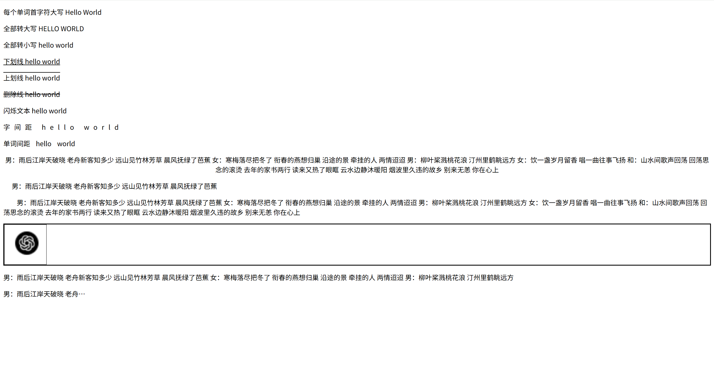

# 软件的架构

## C/S(客户端/服务器)

* 一般我们使用的软件都是C/S架构的
* 比如系统中的软件
  * QQ
  * 微信
  * 等等
* C表示客户端
  * 用户通过客户端来使用软件
* S表示服务器
  * 服务器负责处理软件的业务逻辑
* 特点
  * 使用前必须安装
  * 软件更新时，服务器和客户端得同时更新
  * C/S架构的软件不能跨平台使用
  * C/S架构的软件客户端和服务器通信采用的是自有协议，相对来说比较安全。

## B/S(浏览器/服务器)

* B/S本质上也是C/S，只不过B/S架构的软件，使用浏览器作为软件的客户端
* B/S架构软件通过使用浏览器访问网页的形式，来使用软件
* 特点
  * 不需要安装，直接通过浏览器访问网页
  * 软件更新时，客户端不需要更新
  * 软件可以跨平台，只要系统中有浏览器，就可以使用
  * B/S架构的软件，客户端和服务器通信采用的是通用的HTTP协议，相对来说不安全
  * 可使用HTTPS安全的协议

## W3C标准

* 结构
  * HTML用于描述页面的结构
* 表现
  * CSS用于描述页面的样式
* 行为
  * JavaScript用于描述页面的行为

# HTML简介

* 超文本标记语言
* 它负责网页三要素中的结构
* 使用标签的形式来标识网页中的不同组成部分
* 所谓超文本指的是超链接，使用超链接可以让我们从一个页面跳转到另一个页面

## 标准格式

```html
<!DOCTYPE html>
<html lang="en">
<head>
    <meta charset="UTF-8">
    <title>Document</title>
</head>
<body>

</body>
</html>
```

* `<!DOCTYPE html>`是文档声明

  * HTML4声明方式
    ```html
      <!DOCTYPE HTML PUBLIC "-//W3C//DTD HTML 4.01 Transitional//EN" "http://www.w3.org/TR/html4/loose.dtd">
    ```
  * HTML5声明方式
    ```html
      <!DOCTYPE html>
    ```
  * XHTML声明方式
    ```html
      <?xml version="1.0" encoding="UTF-8"?>
      <!DOCTYPE html
        PUBLIC "-//W3C//DTD XHTML 1.0 Transitional//EN"
        "http://www.w3.org/TR/xhtml1/DTD/xhtml1-transitional.dtd">
    ```
  * 如果不写文档声明，则会导致有些浏览器进入怪异模式，浏览器解析页面无法正常显示
* `<html>`是根标签，有且只有一个，网页中的所有内容写在这个标签里面
* `<head>`标签用来设置网页的头部信息，不会在网页中直接显示，帮助浏览器解析网页
* `<body>`用来设置网页的主体内容，网页中所有可见的内容都写在body标签内
* `<title>`中的内容会显示在网页标题栏，搜索引擎在检索页面时会首先检索title中的内容，它是网页中对于搜索引擎来说最重要的内容，会影响到网页在搜索引擎中的排名
* `<meta charset="UTF-8">`是字符集声明

## html注释

* `<!--注释内容-->`
  * 不会在页面中显示，可在源码中查看
  * 便于自己或其他开发人员的阅读
  * 要养成良好的注释习惯，并且注释要简单明了

## 标签的属性

* 可以通过属性来处理标签的内容
* 可以在开始标签中添加属性
* 属性名 = “属性值”
* 一个标签中可以同时设置多个属性，属性之间需要使用空格隔开

## 进制

* 满几进一
* 二进制
  * 0 1
  * 10 11 100 101 110 111......
* 八进制
  * 0 1 2 3 4 5 6 7
  * 10 11 12 ....16 17 20 21......
* 十进制
  * 0 1 2 3 4 5 6 7 8 9
  * 10 11 12......
* 十六进制
  * 0 1 2 3 4 5 6 7 8 9 A B C D E F
  * 10 11 12...19 1A 1B 1C

## 乱码问题

### 乱码出现的原因

* 计算机在底层只认识0和1
* 在计算机中保存的任何内容，最终都需要转换为二进制编码，包括网页中的内容
* 在读取内容时，需要将二进制编码再转换为正确的内容
* 编码
  * 依据一定的规则，将字符转换为二进制编码的过程
* 解码
  * 依据一定的规则，将二进制编码转换为字符的过程
* 字符集
  * 编码和解码采用的规则，我们称为字符集
  * ASCII
  * ISO-8859-1
  * GBK
    * 中文编码，下面那个也是
  * GB2312
    * 中文系统默认编码
  * UTF-8
    * 万国码，支持世界上所有的文字
  * 等
* 产生乱码的根本原因是，编码和解码采用的字符集不同
* 在中文系统的浏览器中，默认都是使用GB2312进行解码的

### 乱码的解决方法

* 保证编码和解码采用的字符集一致
* 可以在HTML文件中添加字符集声明
  * `<meta charset="UTF-8">`

# 标签

## 常用标签

### 标题标签

* 在HTML中，一共有六级标题标签
* h1~h6
* 在显示效果上h1最大、h6最小，但是文字的大小我们并不关心
* 使用HTML标签时，关心的是标签的语义，我们使用的标签都是语义化标签
* 六级标题中，h1最重要，表示一个网页中的主要内容。h2~h6重要性依次降低
* 对于搜索引擎来说，h1的重要性仅次于title，搜索引擎检索完title，会立即查看h1中的内容
* h1非常重要，他会影响到页面在搜索引擎中的排名，页面一般只写一个h1，否则会被认定为垃圾网站不被搜索
* 一般页面中标题标签只使用h1 h2 h3，其他的基本不使用
  ```html
    <h1>一级标题</h1>
    <h2>二级标题</h2>
    <h3>三级标题</h3>
    <h4>四级标题</h4>
    <h5>五级标题</h5>
    <h6>六级标题</h6>
  ```

  

### 段落标签

* 用于表示内容中的一个自然段
* 使用p标签表示一个段落
* p标签中的文字，默认会独占一行，并且段与段之间会有一个间距
  ```html
    <p>这是一个段落</p>
  ```


### 换行标签

* 在HTML中，字符之间再多的空格，浏览器也会当成一个空格解析
* 换行也会当成一个空格解析
* 为了让浏览器解析时，能够识别换行，需要使用换行标签
* 使用br标签表示一个换行，br是一个自结束标签
  ```html
    悯农
    <br/>
    锄禾日当午，汗滴禾下土。
    <br/>
    谁之盘中餐，粒粒皆辛苦。
  ```

  

### 水平分割线标签

* 使用hr标签表示一个水平分割线
* hr标签是一个自结束标签
  ```html
    巴拉巴拉
    <hr/>
    ps：巴拉巴拉
  ```

  

## 实体

* 在HTML中，一些如><中特色字符是不能直接使用
* 需要使用一些特殊的符号来表示这些特殊字符，这些特殊符号我们称为实体
* 实体语法
  * `&实体名;`
  * `&实体编号;`
* 浏览器解析到实体时，会自动将实体转换为其对应的字符
* 常用实体
  * `&lt;` 小于号 <
  * `&gt;` 大于号 >
  * `&amp;` 与号 &
  * `&nbsp;` 空格
  * `&copy;` 版权符号 ©
  * `&reg;` 注册商标 ®

  ```html
    a<b
    <br/>
    a>c
    <br/>
    ©空     格
  ```

  

## 图片标签

* 使用img标签来向网页中引入一个外部图片
* img标签也是一个自结束标签
* 属性
  * src
    * 设置一个外部图片的路径
  * alt
    * 设置图片的描述
    * 当图片加载失败时，会显示alt中的内容
    * 搜索引擎通过alt来识别不同的图片
    * 搜如果不写alt属性，则搜索引擎不会对img中的图片进行收录
  * width
    * 设置图片的宽度
  * height
    * 设置图片的高度
  * 宽度和高度只设置其中一个，另一个也会等比例调整大小，一般开发中除了自适应的页面，不建议设置width和height属性，而是让美工修改图片。
* 相对路径
  * src属性配置的是图片的路径，目前我们所要使用的路径全都是相对路径
  * 相对于当前资源所在目录的位置
  * ../是返回上级文件夹
* 图片格式
  * JPG
    * 支持颜色比较多，图片可以压缩，但是不支持透明
    * 一般用来保存照片等颜色丰富的图片
  * GIF
    * 支持的颜色少，只支持简单的透明，支持动态图
    * 图片颜色单一或者是动态图用gif
  * PNG
    * 支持的颜色多，并且支持复杂的透明
    * 用来显示颜色复杂的透明的图片
  * SVG
    * 支持的颜色多，并且支持复杂的透明
    * 用来显示颜色复杂的透明的图片
    * 支持缩放
    * 可以通过代码来控制图片的大小
  * WEBP
    * 谷歌新推出的用来表示网页中图片的一种格式
    * 具备其他格式图片的所有优点
    * 文件还特别小
    * 但是兼容性不好
  * base64
    * 字符流图片
    * 通过base64转换为字符
    * 一般都是一些需要和网页一起加载的图片才会使用base64
  * 图片的使用原则
    * 效果不一致，使用效果好的
    * 效果一致，使用小的

  ```html
    <!--引入本地图片-->
    
    <!--引用外部图片-->
    
  ```

## meta标签

* charset
  * 设置网页的字符集

  ```html
    <meta charset="UTF-8">
  ```
* keywords
  * 设置网页的关键字

  ```html
    <meta name="keywords" content="HTML5,JavaScript,前端，Java">
  ```
* description
  * 设置网页的描述

  ```html
    <<meta name="description" content="发布h5、js等前端相关信息">
  ```
* 搜索引擎在检索页面时，会同时检索页面的关键词和描述，但是这两个值不会影响页面在搜索引擎中的排名
* refresh（刷新）
  * 刷新/请求重定向

  ```html
    <!--页面3秒后自动刷新-->
    <meta http-equiv="refresh" content="3;url=index.html"/>
    <!--请求重定向，5秒后打开某网址-->
    <meta http-equiv="refresh" content="5;url=https://www.baidu.com">
  ```

## 布局标签

* header
  * 网页头部

  ```html
    <header></header>
  ```
* main
  * 网页的主体部分
  * 一个页面中只能有一个main

  ```html
    <main></main>
  ```
* footer
  * 网页的底部

  ```html
    <footer></footer>
  ```
* nav
  * 网页的导航栏

  ```html
    <nav></nav>
  ```
* aside
  * 网页的侧边栏

  ```html
    <aside></aside>
  ```
* article
  * 网页的文章

  ```html
    <article></article>
  ```
* section
  * 独立的区块

  ```html
    <section></section>
  ```
* div
  * 没有语义，一个块
  * 目前主要的布局元素
  * 可以代替上边的所有

  ```html
    <div></div>
  ```
* center
  * 居中
  * 已过时，一般用css实现

  ```html
    <center><p>居中显示</p></center>
  ```

# xHtml的语法规范

* HTML中不区分大小写，但是一般都使用小写
* 注释不能嵌套
* 必须结构完整，要么成对出现，要么自结束标签
* 浏览器尽最大的努力正确的解析页面，你所有不符合语法规范的内容，浏览器都会为你自动修正，但是有些情况修正会出现错误
* 可以嵌套，但是不能交叉嵌套
* 属性必须有值，且值必须加引号
* 双引号单引号都可以
* 不按规范也没问题，浏览器可以修正，但最好按规范

# 内联框架

* 引入一个外部的页面
* 属性
  * src

    * 设置一个外部页面的路径,可以是相对路径也可以是绝对路径
  * height

    * 设置框架的高度
  * width

    * 设置框架的宽度
  * name

    * 设置框架的名称
* 在现实开发中不推荐使用内联框架，因为内联框架中的内容不会被搜索引擎所检索
  ```html
    <body>
      <h1>百度</h1>
      <iframe src="https://www.baidu.com" name="tom"></iframe>
    </body>
  ```

  

# 超链接

* 使用超链接可以让我们从一个页面跳转到另一个页面
* 使用a标签来创建一个超链接
* 属性
  * href
    * 指向链接跳转的目标地址，可以写一个相对路径，也可以写一个完整的地址
    * 将该属性值设置为#，点击超链接后回到页面顶部
    * 将该属性值设置为#id，会跳转到该id元素
  * target
    * 打开链接的方式
    * _self
      * 默认值，在当前页面打开链接
    * _blank
      * 在新的页面打开链接
    * _parent
      * 在父级框架中打开链接
    * _top
      * 在整个窗口中打开链接
    * 框架名称
      * 在指定的框架中打开链接

  ```html
    <body>
        <a href="https://cn.vuejs.org/" target="tom">vue</a>
        <iframe src="https://www.baidu.com" name="tom"></iframe>
    </body>
  ```

  

# CSS简介

* 层叠样式表
* CSS可以用来为网页创建样式表，通过样式表对网页进行装饰
* 层叠是将整个网页想象成一层一层的结构，层次高的将会覆盖层低的
* CSS可以为网页的各个层次设置样式

## 内联样式

* 将CSS样式写到元素的style属性当中
* 内联样式只对当前的元素中的内容起作用
* 内联样式不方便样式复用
* 属于结构与表现耦合，不方便后期维护
* 不推荐使用
  ```html
    <p style="color: rebeccapurple;font-size: 30px">锄禾日当午，汗滴禾下土</p>
  ```

## 内部样式

* 将CSS样式写到head标签中的style标签中
* 通过CSS选择器选中指定元素
* 可以同时为这些元素设置样式，使样式进一步复用
* 可以使表现和结构进一步分离
* 推荐的一种使用方式
  ```html
    <!DOCTYPE html>
    <html lang="en">
      <head>
          <meta charset="UTF-8">
          <title>Title</title>
          <style type="text/css">
              p{
                  color: rebeccapurple;
                  font-size: 30px;
              }
          </style>
      </head>
      <body>
          <p>锄禾日当午，汗滴禾下土</p>
          <p>谁之盘中餐，粒粒皆辛苦</p>
      </body>
    </html>
  ```

  

## 外部样式

* 将CSS样式编写到外部CSS文件中
* 步骤

  * 创建一个CSS文件，文件后缀名为.css
  * 编写CSS样式

  ```css
    p{
        color: rebeccapurple;
        font-size: 30px;
    }
  ```

  * 在HTML文件中通过link标签引入CSS文件

  ```html
    <!DOCTYPE html>
    <html lang="en">
      <head>
          <meta charset="UTF-8">
          <title>Title</title>
          <link rel="stylesheet" href="css/style.css"/>
      </head>
      <body>
          <p>锄禾日当午，汗滴禾下土</p>
          <p>谁之盘中餐，粒粒皆辛苦</p>
      </body>
    </html>
  ```
* 可以完全使结构和表现分离，使样式表在不同的页面中使用，最大限度的使样式进行复用
* 将样式统一写在CSS文件中，然后通过link标签引入，可以利用浏览器的缓存，加快用户访问的速度，提高了用户体验。
* 最推荐使用

## CSS的语法

### CSS注释

```css
  /*这是单行注释*/
  /*
    这是一个多行CSS注释
  */
```

### CSS选择器

* 通过选择器可以选中页面中指定的元素
* 将声明块中的样式应用到选择器对应的元素上

### CSS声明块

* 写在选择器后边
* 使用{}括起来
* 实际上就是一组键值对结构，一键值对称为一个声明
* 多个声明之间使用;来隔开
* 声明的样式名和样式值之间使用:来连接

### 块元素和行内元素（内联元素）

* 块元素
  * 独占一行，无论内容有多少
  * div、p、h1、h2...是块元素
  * div标签没有任何语义，就是一个纯粹的块，并且不会为它里边的元素设置任何的默认样式
  * div元素主要用来对页面进行布局的
* 行内元素/内联元素
  * 只占自身大小的元素，不会占用一行
  * a、img、iframe、span是一个内联元素（行内元素）
  * span标签没有任何语义，专门用来选中文字，然后为文字设置样式
* 块元素做页面中的布局，内联元素用来选中文本设置样式
* 一般只使用块元素去包含内联元素，不会用内联元素去包含块元素
* a元素可以包含任意元素，除了它本身
* p元素不能包含任何其他的块元素
* HTML5已经没有内联元素和块元素的概念了

# 选择器

* 详情查看[选择器](选择器.html)

## 常用选择器

### 元素（标签）选择器

* 可以选择页面中的所有指定元素
* 语法
  * 标签名{}
  * 如：选中所有的p元素

  ```css
    p{
        color: red;
    }
  ```

### id选择器

* 通过元素的id属性值选中唯一一个元素
* 语法
  * #id值{}
  * 如：选中id为p1的元素

  ```css
    #p1{
        color: red;
    }
  ```

### 类选择器

* 通过元素的class属性值选中一组元素
* 与id选择器类似，但是可以重复
* 拥有相同class属性值的元素，他们是一组元素
* 可以同时为一个元素设置多个class属性值，多个值之间使用空格隔开
* 语法
  * .class值{}
  * 如：选中class为p2的元素

  ```css
    .p2{
        color: red;
    }
  ```

### 通配选择器

* 选中页面中所有的元素
* 语法
  * *{}
  * 如：选中所有的元素

  ```css
    *{
        color: red;
    }
  ```

### 并集选择器（选择器分组）

* 同时选中多个选择器对应的元素
* 语法
  * 选择器1,选择器2,选择器3...{}
  * 如：选中所有的p元素或者class为p2的元素或者id为p1的元素

  ```css
    p,.p2,#p1{
        color: red;
    }
  ```

### 交集选择器（复合选择器）

* 选中同时满足多个选择器的元素
* 对于id选择器来说，不建议使用复合选择器
* 语法
  * 选择器1选择器2选择器3...{}
  * 如：选中class为p2的div元素

  ```css
    div.p2{
        color: red;
    }
  ```

### 后代元素选择器

* 选中指定元素的所有后代元素
* 语法
  * 选择器1 选择器2{}
  * 如：选中div中的所有p元素

  ```css
    div p{
        color: red;
    }
  ```

### 子元素选择器

* 选中指定元素的所有子元素
* IE6及以下的浏览器不支持子元素选择器
* 语法
  * 父元素 > 子元素{}
  * 如：选中div的子元素中的所有p元素

  ```css
    div > p{
        color: red;
    }
  ```

### 伪类选择器

* 伪类选择器是用来选中元素的某种状态
* 比如：访问过的超链接，普通的超链接，获取焦点的文本框，鼠标悬停的元素等
* 伪类选择器的语法
  * 选择器:伪类名{}

  ```css
    /*选中所有的a元素的鼠标悬停状态*/
    a:hover{
        color: red;
    }
    /*选中所有的a元素的访问过的状态*/
    a:visited{
        color: red;
    }
    /*选中所有的a元素的激活状态*/
    a:active{
        color: red;
    }
    /*选中所有的a元素的未访问状态*/
    a:link{
        color: red;
    }
    /*选中所有的input元素的获取焦点状态*/
    input:focus{
        color: red;
    }
    /*指定元素前面的内容，一般需要结合content样式一起使用，通过content可以向before或after添加一些内容*/
    p::before{
        content: "这是p元素前面的内容";
    }
    /*指定元素后面的内容，一般需要结合content样式一起使用，通过content可以向before或after添加一些内容*/
    p::after{
        content: "这是p元素后面的内容";
    }
    /*选中的元素*/
    p::selection{
        color: red;
    }
    /*选中的元素，火狐浏览器*/
    p::-moz-selection{
        background-color: burlywood;
    }
  ```
* IE6中不支持对超链接以外的元素设置hover和active

### 伪元素选择器

* 伪元素选择器是用来选中元素的某个部分
* 比如：第一个字符，第一个字母，第一个行，第一个段落等
* 伪元素选择器的语法
  * 选择器::伪元素名{}

  ```css
    /*选中所有的p元素的第一个字符*/
    p::first-letter{
        color: red;
    }
    /*选中所有的p元素的第一个行*/
    p::first-line{
        color: red;
    }
    /*选中所有的p元素的第一个段落*/
    p::first-letter{
        color: red;
    }
  ```

### 属性选择器

* 根据元素中的属性或属性值来选择指定元素
* 语法
  * [属性名] 选取含有指定属性名的元素
  * [属性名=属性值] 选取含有指定属性名和属性值的元素
  * [属性名^=属性值] 选取属性值以指定值开头的元素
  * [属性名$=属性值] 选取属性值以指定值结尾的元素
  * [属性名*=属性值] 选取属性值中包含指定值的元素

  ```css
    /*选中所有具有href属性的a元素*/
    a[href]{
        color: red;
    }
    /* 选中所有的class属性值为p2的元素*/
    [class=p2]{
        color: red;
    }
    /* 选中所有的class属性值以pa开头的元素*/
    [class^=pa]{
        color: red;
    }
    /* 选中所有的class属性值以pa结尾的元素*/
    [class$=pa]{
        color: red;
    }
    /* 选中所有的class属性值中包含pa的元素*/
    [class*=pa]{
        color: red;
    }
  ```

### 子元素伪类

* 子元素伪类是用来选中元素的子元素的
* 语法
  ```css
    /*选中所有的p元素的第一个子元素,当第一个子元素不是p元素时则无效*/
    div:first-child{
        color: red;
    }
    /*选中所有的p元素的最后一个子元素,当最后一个子元素不是p元素时则无效*/
    div:last-child{
        color: red;
    }
    /*选中所有的p元素的第n个子元素,当第n个子元素不是p元素时则无效*/
    div:nth-child(n){
        color: red;
    }
    /* 选中所有的p元素的偶数位子元素 */
    div:nth-child(even){
        color: red;
    }
    /* 选中所有的p元素的奇数位子元素 */
    div:nth-child(odd){
        color: red;
    }
    /* 选择同类型标签第一个子元素 */
    div:first-of-type{
        color: red;
    }
    /* 选择同类型标签最后一个子元素 */
    div:last-of-type{
        color: red;
    }
    /* 选择同类型标签第n个子元素 */
    div:nth-of-type(n){
        color: red;
    }
  ```
* child和of-type的区别
  * child是选中所有的子元素，of-type是选中同类型的子元素
  * child是从1开始计数，of-type是从0开始计数

### 兄弟元素选择器

* 兄弟元素选择器是用来选中元素的兄弟元素的
* 语法
  ```css
    /* 选中span后的一个p元素 */
    span + p{
        color: red;
    }
    /* 选中span后的所有p元素 */
    span ~ p{
        color: red;
    }
  ```

### 否定伪类

* 否定伪类是用来选中不满足条件的元素的
* 语法
  ```css
    /* 选中所有的p元素，但是不包括class为p2的元素 */
    p:not(.p2){
        color: red;
    }
  ```

### 样式的继承

* 后代元素会继承祖先元素上的样式
* 利用继承，可以将一些基本的样式设置给祖先元素，所有的后代元素都会继承这些样式
* 并不是所有的样式都会被后代元素所继承，如：背景、边框、定位相关的样式不会被继承

### 样式的优先级

* 当一个元素上有多个样式时，会根据样式的优先级来决定最终的样式
* 样式的优先级分为以下几种
  * 行内样式 > 内部样式 > 外部样式
  * 当行内样式和内部样式同时存在时，会根据样式的优先级来决定最终的样式

### 选择器的优先级

* 当使用不同的选择器选中同一个元素，并且设置相同的样式，这时样式之间产生了冲突，优先级高的优先显示
* 优先级规则
  * 内联样式：1000
  * id选择器：100
  * 类和伪类选择器：10
  * 标签选择器： 1
  * 通配选择器： 0
* 继承的样式，没有优先级
* 当选择器中包含多种选择器时，需要将多种选择器的优先级相加进行比较，但是，选择器优先级计算不会超过他的最大数量级
* 如果选择器的优先级一样，后声明的样式会覆盖先声明的样式
* 并集选择器的优先级是单独计算的，不会相加
* 可以在样式的最后，添加一个!important，则此时该样式将会获得最高的优先级，但是在开发中尽量避免使用

### 伪类的顺序

* 这四个选择器的优先级是一样的，但是请按以上的顺序写，不然会被覆盖
  * :link
  * :visited
  * :hover
  * :active

# 文本标签

* `<em>`
  * 斜体
  * 用于表示强调的内容
  * 有语义
* `<strong>`
  * 加粗
  * 用于表示重要的内容
  * 有语义
* `<i>`
  * 斜体
  * 用于表示斜体的内容
  * 无语义
* `<b>`
  * 加粗
  * 用于表示加粗的内容
  * 无语义
* `<small>`
  * 比父元素字号小一些
  * 表示一类细则内容
  * 如：合同中小字、网站版权声明等
* `<cite>`
  * 表示参考内容
  * 如：书名、歌曲名、电影名等
* `<q>`
  * 引号
  * 短引用（行内引用）
  * 引号不能被选中
* `<blockquote>`
  * 长引用（块级引用）
* `<sup>`
  * 上标
  * 如：2的9次方
* `<sub>`
  * 下标
* `<ins>`
  * 下划线
  * 表示插入的内容
* `<del>`
  * 删除线
  * 表示删除的内容
* `<pre>`
  * 预格式标签
  * 保留代码原格式
* `<code>`
  * 代码标签
  * 表示一段代码
    [文本标签](文本标签.html)
    

# 列表

## 无序列表

* 无序列表使用ul标签来定义
* 每个列表项使用li标签来定义
* 列表项前面会显示一个小的蓝色的圆点
* 无序列表的语法
  ```html
    <ul>
        <li>列表项1</li>
        <li>列表项2</li>
        <li>列表项3</li>
    </ul>
  ```
* 小圆圈的类型可以通过list-style-type属性来修改
  * disc
    * 默认值，蓝色实心圆点
  * circle
    * 黑色空心的圆点
  * square
    * 实心方块
  * none
    * 不显示列表项前面的小圆圈

  ```css
    ul{
        list-style-type: disc;
    }
  ```
* 小圆圈的位置可以通过list-style-position属性来修改
  * outside
    * 默认值，列表项前面的小圆圈会显示在列表项的外面
  * inside
    * 列表项前面的小圆圈会显示在列表项的里面

  ```css
    ul{
        list-style-position: outside;
    }
  ```
* 可以通过list-style-image属性将小圆圈替换为一个图片
  * url(图片路径)
    * 显示一个小的图片

  ```css
    ul{
        list-style-image: url(images/1.png);
    }
  ```

## 有序列表

* 有序列表使用ol标签来定义
* 每个列表项使用li标签来定义
* 列表项前面会显示一个数字
* 有序列表的语法
  ```html
    <ol><!--有序列表,默认1234-->
        <li>苹果</li><!--列表项-->
        <li>橘子</li>
        <li>香蕉</li>
    </ol>
  ```
* 数字的类型可以通过list-style-type属性来修改
  * decimal
    * 默认值，数字
  * decimal-leading-zero
    * 数字前面会显示0
  * lower-alpha
    * 小写字母
  * upper-alpha
    * 大写字母
  * lower-roman
    * 小写罗马数字
  * upper-roman
    * 大写罗马数字
  * none
    * 不显示列表项前面的数字

    ```css
      ol{
          list-style-type: decimal;
      }
    ```

    

## 自定义列表

* 自定义列表使用dl标签来定义
* 每个列表项使用dt标签来定义
* 每个列表项的描述使用dd标签来定义
* 自定义列表的语法
  ```html
    <dl>
        <dt>武松</dt>
        <dd>打老虎很厉害</dd>
        <dt>许嵩</dt>
        <dd>写歌很厉害</dd>
        <dt>松鼠</dt>
        <dd>吃坚果很厉害</dd>
    </dl>
  ```

  

## 列表的嵌套

* ul，ol，dl列表之间可以互相嵌套
  ```html
   <ul><!--无序列表，默认圆点-->
       <li>水果</li><!--列表项-->
       <ol><!--嵌套列表-->
           <li>苹果</li><!--列表项-->
           <li>橘子</li>
           <li>香蕉</li>
       </ol>
       <li>动物</li>
       <ul><!--嵌套列表-->
           <li>猫</li><!--列表项-->
           <li>狗</li>
           <li>猪</li>
           <li>鱼</li>
       </ul>
       <dl>
           <dt>武松</dt>
           <dd>打老虎很厉害</dd>
           <dt>许嵩</dt>
           <dd>写歌很厉害</dd>
           <dt>松鼠</dt>
           <dd>吃坚果很厉害</dd>
       </dl>
   </ul>
  ```

  

# 长度单位

* px
  * 像素
  * 最常用的单位
  * 不同的显示器一个像素的大小也不同，显示效果越好越清晰，像素点越小，反之像素点越大
* %
  * 百分比
  * 相对于父元素的宽度或高度的百分比
  * 当父元素值发生变化时子元素也会等比例变化
  * 创建自适应页面时经常使用百分比作为单位
* em
  * 相对于自身元素的字体大小来计算
  * 1em = 1font-size
  * 当字体大小发生改变，em也会随之改变
  * 设置字体相关的样式时使用
* rem
  * 相对于根元素的字体大小来计算
    [长度单位](长度单位.html)
    

# 颜色单位

## 单词

* red 红色
* blue 蓝色
* green 绿色
* 等

## RGB

* RGB指的是Red Green Blue三原色
  * 通过这三种颜色的不同浓度，来表示不同的颜色
  * 语法：
    * rgb(红色浓度,绿色浓度,蓝色浓度)
    * 浓度范围：0-255
    * 浓度也可以采用百分数表示

## RGBA

* 在RGB的基础上增加一个a表示不透明度
* 需要四个值，前三个和rgb一样，第四个表示不透明度
* 不透明度的范围：0-1

## 十六进制

* 与RGB原理一样
* 使用三组两位的十六进制数组表示一个颜色
* 每组取00~ff
* 语法
  * #rrggbb
* 两位重复的颜色可以简写，如#ff0000可写成#f00

## HSL和HSLA

* HSL指的是Hue(色相)，Saturation(饱和度)，Lightness(亮度)
* 色相：0-360
* 饱和度：0-100%
* 亮度：0-100%
* 语法
  * hsl(色相,饱和度,亮度)
  * hsla(色相,饱和度,亮度,不透明度)

# 字体

## 属性

* color
  * 字体颜色
  * 可以使用单词，rgb，rgba，十六进制，hsl，hsla等

  ```css
    color: red;
  ```
* font-size
  * 字体大小
  * 浏览器一般默认的文字大小都是16px
  * 设置的并不是文字本身的大小
  * 在页面中，每个文字都是放在一个看不见的格子中
  * 设置的font-size实际上是设置格的高度
  * 一般情况文字实际大小要比格子小
  * 根据字体的不同，显示效果也不同
  * 浏览器最小字体大写是12px

  ```css
    font-size: 16px;
  ```
* font-family
  * 字体
  * 当浏览器支持则使用该字体
  * 如果浏览器不支持则使用默认字体
  * 同时指定多个字体，多个字体之间使用,分开，当采用多个字体时，浏览器会优先使用前边的字体，如果前边不支持，再逐一使用后边的字体
  * 浏览器使用的字体就是用户计算机的字体
  * 在开发中尽量不要用不常用的字体

  ```css
    font-family: "宋体", "微软雅黑", "黑体";
  ```
* font-style
  * 字体样式
  * normal 正常
  * italic 斜体
  * oblique 倾斜
  * inherit 继承父元素的字体样式

  ```css
    font-style: normal;
  ```
* font-weight
  * 字体粗细
  * normal 正常
  * bold 加粗
  * bolder 更粗
  * lighter 更细
  * inherit 继承父元素的字体粗细
  * 100-900
    * 数字越大越粗
    * 400是正常
    * 由于用户计算机没有这么多级别的字体，所以不能达到我们想要的效果，一般不使用

  ```css
    font-weight: normal;
  ```
* font-variant
  * 字体变形
  * normal 正常
  * small-caps 小型大写字母
  * inherit 继承父元素的字体变形

  ```css
    font-variant: normal;
  ```
* font
  * 同时设置字体所有类型的样式
  * 不同的值用空格隔开
  * 必要属性
    * font-size
    * font-family
    * 必须先写font-size，再写font-family
  * 可选属性
    * font-style
    * font-weight
    * font-variant
  * 设置的属性会继承父元素值（如未指定 font-weight 则沿用父级设置）

  ```css
    font: 16px "宋体", "微软雅黑", "黑体";
  ```

## 字体分类

* serif 衬线字体
* sans-serif 非衬线字体
* monospace 等宽字体
* cursive 草书字体
* fantasy 虚幻字体
* system-ui 系统字体
* emoji 表情符号字体
* math 数学字体
* 可以将字体设置为大的分类，浏览器会自动选择指定的字体样式并应用样式
* 一般会将字体的大分类，指定为font-family中的最后一个字体

```html
  <p class="p1">我是p标签</p>
  <p style="font-family: Serif;">衬线字体abcdEFG</p>
  <p style="font-family: sans-serif;">非衬线字体abcdEFG</p>
  <p style="font-family: monospace;">等宽字体abcdEFG</p>
  <p style="font-family: cursive;">草书字体abcdEFG</p>
  <p style="font-family: fantasy;">虚幻字体abcdEFG</p>
```

## 行高

* 在CSS中并没有直接设置行间距的方式
* 通过设置行高间接的设置行间距，行高越大，行间距越大
* 使用line-height设置行高

```css
  line-height: 40px;
```

* 网页中的文字会默认在行高中垂直居中
* 行间距 = 行高 - 字体大小
* 可以传一个百分数，则会相对于字体去计算行高

```css
  line-height: 150%;
```

* 可以传一个整数，则行高会设置字体大小相应的倍数

```css
  line-height: 1.5;
```

* 对于单行文本来说，将行高设置为和父元素的高度一致，可以使文本垂直居中
* 在font中也可以指定行高

```css
  font: 16px/40px "宋体", "微软雅黑", "黑体";
```

[行高](行高.html)


## 文本样式

* text-transform

  * 文本转换
  * none 不转换
  * capitalize 首字母大写
  * uppercase 全部大写
  * lowercase 全部小写
  * inherit 继承父元素的文本转换

  ```css
    text-transform: none;
  ```
* text-decoration

  * 文本装饰
  * none 不装饰
  * underline 下划线
  * overline 上划线
  * line-through 删除线
  * blink 闪烁
  * inherit 继承父元素的文本装饰

  ```css
    text-decoration: none;
  ```
* text-align

  * 文本对齐
  * left 左对齐
  * right 右对齐
  * center 居中对齐
  * justify 两端对齐
  * inherit 继承父元素的文本对齐

  ```css
    text-align: left;
  ```

  * a标签超链接默认添加下划线，如果要去除，则将text-decoration设置为none
* letter-spacing

  * 字母间距
  * 可以传一个值，值为正数，则会增加字母间距，值为负数，则会减少字母间距
  * 可以传一个百分数，则会相对于字体去计算字母间距

  ```css
    letter-spacing: 10px;
  ```
* word-spacing

  * 单词间距
  * 可以传一个值，值为正数，则会增加单词间距，值为负数，则会减少单词间距
  * 可以传一个百分数，则会相对于字体去计算单词间距

  ```css
    word-spacing: 10px;
  ```
* text-indent

  * 文本缩进

  ```css
    /* 缩进20px */
    text-indent: 20px;
    /* 缩进两个字体 */
    text-indent: 2em;
  ```
* text-align

  * 文本对齐
  * left 左对齐
  * right 右对齐
  * center 居中对齐
  * justify 两端对齐
  * inherit 继承父元素的文本对齐

  ```css
    text-align: left;
  ```

[文本样式](文本样式.html)


# 盒模型

* CSS处理网页时，认为每个元素都包含在一个不可见的盒子里
* 只需要将相应的盒子摆放到网页中相应的位置即可完成网页的布局
* 一个盒子可分成4个部分
  * 内容区（content）
  * 内边距（padding）
  * 边框（border）
  * 外边距（margin）

## 边框

* 要为元素设置边框必须指定三个样式
  * border-width
    * 边框的宽度
    * 如果设置四个值,则会分别设置上右下左的边框宽度
    * 如果只设置三个值，则会分别设置给上 左右 下
    * 如果只设置两个值，则会分别设置给上下 左右
    * 如果只设置一个值，则设置给四边
  ```css
    border-width: 1px;
    border-width: 1px 2px;
    border-width: 1px 2px 3px;
    border-width: 1px 2px 3px 4px;
  ```
  * border-color
    * 边框的颜色
    * 如果设置四个值,则会分别设置上右下左的边框颜色
    * 如果只设置三个值，则会分别设置给上 左右 下
    * 如果只设置两个值，则会分别设置给上下 左右
    * 如果只设置一个值，则设置给四边
  ```css
    border-color: red;
    border-color: red blue;
    border-color: red blue green;
    border-color: red blue green yellow;
  ```
  * border-style
    * 边框的样式
    * 如果设置四个值,则会分别设置上右下左的边框样式
    * 如果只设置三个值，则会分别设置给上 左右 下
    * 如果只设置两个值，则会分别设置给上下 左右
    * 如果只设置一个值，则设置给四边
    * 枚举值
      * none 无边框
      * hidden 隐藏边框
      * solid 实线
      * dotted 点状边框
      * dashed 虚线
      * double 双线边框
  ```css
    border-style: solid;
    border-style: solid dotted dashed double;
  ```
* 大部分的浏览器中，边框的宽度和颜色都是有默认值的，而边框的样式默认值都为none
* width和height属性只是设置盒子的内容区大小，而不是盒子的整个大小
* border-xxx-width
  * 设置指定位置边框的宽度
  * 枚举值
    * top
    * right
    * bottom
    * left
```css
 border-top-width: 5px;
```

* border-xxx-color
  * 设置指定位置边框的颜色
  * 枚举值
    * top
    * right
    * bottom
    * left
```css
 border-left-color: red;
```

* border-xxx-style
  * 设置指定位置边框的样式
  * 枚举值
    * top
    * right
    * bottom
    * left
```css
 border-right-style: dashed;
```

### 边框简写
* border
  * 设置边框的样式、宽度、颜色
  * 无任何顺序要求
  * 不能分别指定每个边
```css
  border: 5px solid red;
```
* border-xxx
  *  设置指定位置的边框样式、宽度、颜色
  * 枚举值
    * top
    * right
    * bottom
    * left
```css
  border-right: 5px solid red;
```
## 内边距
* 内容区与盒子边框之间的距离
* padding-xxx
  * 设置指定位置的内边距
  * 枚举值
    * top
    * right
    * bottom
    * left
```css
  padding-top: 10px;
```
* padding
  * 设置所有边的内边距
  * 如果设置四个值,则会分别设置上右下左的边框样式
  * 如果只设置三个值，则会分别设置给上 左右 下
  * 如果只设置两个值，则会分别设置给上下 左右
  * 如果只设置一个值，则设置给四边
```css
  padding: 10px;
  padding: 10px 20px;
  padding: 10px 20px 30px;
  padding: 10px 20px 30px 40px;
```
* 内边距会影响盒子的可见框的大小
* 元素的背景会影响内容区和内边距
* 盒子的大小(可见大小) = 内容区 + 内边距 + 边框

## 外边距
* 盒子与盒子之间的距离
* 不会影响盒子可见框的大小，而是会影响盒子的位置
* margin-xxx
  * 设置指定位置的外边距
  * 枚举值
    * top
    * right
    * bottom
    * left
```css
  margin-top: 10px;
```
* 由于页面中的元素都是左上角摆放的，所以设置上和左外边距时，会导致盒子的位置发生改变。
* 而设置右和下外边距时，会改变其他盒子的位置
* 外边距也可以定为负值，往反方向移动
* margin
  * 设置所有边的外边距
  * 如果设置四个值,则会分别设置上右下左的边框样式
  * 如果只设置三个值，则会分别设置给上 左右 下
  * 如果只设置两个值，则会分别设置给上下 左右
  * 如果只设置一个值，则设置给四边
```css
  margin: 10px;
  margin: 10px 20px;
  margin: 10px 20px 30px;
  margin: 10px 20px 30px 40px;
```
* 可以设置为auto
  * 一般只设置水平方向的auto
  * 只指定左外边距和右外边距其中一个的margin为auto则会将外边距设置为最大值
  * 垂直方向设置为auto，则外边距默认就是0
  * 同时将左外边距和右外边距同时设置为auto时，则会将两侧外边距设置为相同的值，即在父元素中水平居中，常用
```css
  margin: 0 auto;
```
* 扩展
  * width和height也可以设置为auto
  * 此时会根据内容区的大小来设置宽度和高度
  * 当元素的宽度或高度的值是auto时，此时指定内边距不会影响可见框的大小，而是会自动修改宽度，以适应内边距
```css
  width: auto;
  height: auto;
```

## 垂直外边距的重叠
* 当两个垂直方向的外边距相遇时，会发生外边距重叠
* 兄弟元素垂直方向的外边距相遇时，取两个外边距中的最大值
* 父子元素垂直方向的外边距相遇时，会把外边距设置给父元素，且取两个外边距中的最大值
* 只想移动子元素的解决方法
  * 新增元素让当前子元素与父元素隔开
  * 为父元素设置边框
  * 为父元素设置内边距
[外边距重叠](外边距重叠.html)

# 浏览器默认样式
* 浏览器会为页面设置默认样式，让页面在没有样式时更好的显示
* 所以会为很多元素设置一些默认的margin和padding
* 正常情况下不需要使用默认值，可以将默认值重置为0
* 可以使用通配符重置所有元素的默认值
```css
  * {
    margin: 0;
    padding: 0;
  }
```

# 内联元素的盒模型
* 内联元素不能设置内容区的宽度（width）和高度(height)
* 内联元素可以设置水平方向的内边距
* 内联元素可以设置垂直方向的内边距，但是不会影响页面布局，可能会把其他元素覆盖
* 内联元素可以设置边框，但是垂直方向的边框不会影响页面布局，可能会把其他元素覆盖
* 内联元素可以设置水平方向的外边距、不能设置垂直方向的外边距
[内联元素的盒模型](内联元素的盒模型.html)


# display和visibility

## display
* 修改元素类型
* 可以将块元素改成内联元素，也可以将内联元素改成块元素
* 枚举值
  * block 块元素
  * inline 内联元素
  * inline-block 内联块元素（行内块元素）
    * 可以使一个元素既有内联元素的特点，又有块元素的特点
    * 既可以设置宽高，又不会独占一行
  * table 表格元素
  * none 隐藏元素
  * flex 弹性盒子

## visibility
* 修改元素的可见性
* 枚举值
  * visible 可见
  * hidden 隐藏

## display:none与visibility:hidden的区别
* display:none会隐藏元素，并且会让元素不再占用空间
* visibility:hidden会隐藏元素，但是会让元素继续占用空间

# overflow（溢出）
* 子元素默认在父元素的内容区中
* 但如果子元素的大小超过父元素的内容区，则超过的大小会在父元素以外显示
* 超出父元素的内容称为溢出内容
* 通过overflow为父元素设置如何处理溢出内容
* 枚举值
  * visible 不做任何处理（可见）
    * 溢出内容会在父元素外显示，默认值
  * hidden 隐藏溢出内容
    * 溢出内容不会在父元素外显示
  * scroll 显示滚动条
    * 溢出内容会被修剪，但是有滚动条可查看其余内容
    * 该属性无论内容是否溢出，都会显示双向滚动条
  * auto 自动显示滚动条
    * 自动添加滚动条，比scroll更加智能

# 文档流
* 文档流处在网页的最底层，它表示的是一个页面中的位置
* 我们所创建的元素默认都处在文档中

## 元素在文档流中的特点

### 块元素
* 在文档流中独占一行，会默认自上向下排列
* 在文档流中默认宽度是父元素的100%
* 在文档流中默认高度默认被内容区撑开

### 内联元素
* 在文档流中只占自身的大小，会默认从左向右排列
* 会自动换行
* 在文档流中的宽度和高度默认都被内容撑开

## 浮动
* 把浮动想象成气球
* 如果希望块元素在页面中水平排列，可以使块元素脱离文档流
* 使用float使元素浮动，从而脱离文档流
* 当为一个元素设置浮动以后，元素会立即脱离文档流，还在文档流中的元素会重新按文档流摆放位置
* 元素浮动以后会尽量向左上或者右上漂浮，直到遇到父元素的内容区边界或没有浮动的块元素或其它浮动元素为止
* 如果浮动元素上边是一个没有浮动的块元素，则浮动元素不会超过块元素
* 浮动的元素不会超过它的相邻兄弟元素，最多顶部对齐
### float
* 枚举值
  * none 不浮动
  * left 向左浮动
  * right 向右浮动
  * inherit 继承父元素的浮动
[浮动](浮动.html)
